# ZooKeeper Server Architecture: Progressive Code Deep Dive

> **Scope**
>
> - Server source: `/mnt/d/lhub/source/zookeeper_server/main`
> - Paper: `/mnt/d/lhub/MIT_Distributed_Systems/papers/zookeeper.pdf`
> - Primary source root used below: `/mnt/d/lhub/source/zookeeper_server/main/java/org/apache/zookeeper`
> - No `.org` files were read or searched.
>
> **Source-version caveat:** the extracted `java-filtered/org/apache/zookeeper/version/Info.java`
> still contains Maven placeholders such as `${parsedVersion.majorVersion}`. The exact
> ZooKeeper release therefore cannot be established from this source snapshot alone.
> The implementation is newer than the 2010 paper: it includes observers, dynamic
> reconfiguration, persistent watches, container/TTL nodes, request throttling,
> Netty, TLS/SASL, metrics, and other later features.

## 1. Architectural thesis

ZooKeeper is a replicated, in-memory hierarchical data store optimized for
coordination. Its server architecture is built around one central rule:

> **Every replicated mutation is prepared as a deterministic transaction, ordered by
> a zxid, durably replicated through Zab, and only then applied to the in-memory
> `DataTree`.**

Reads usually execute against a server's local in-memory state. Writes pass through
the leader and a quorum. Sessions tie a client's liveness to ephemeral state.
Watches turn committed state transitions into one-shot or persistent notifications.
Snapshots and transaction logs reconstruct the same state after restart.

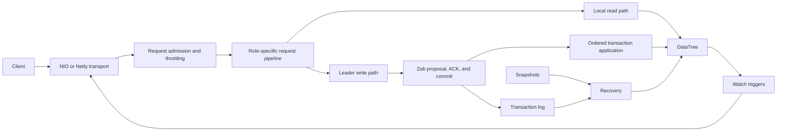

## 2. Guiding design principles

### 2.1 Separate coordination semantics from transport

`ServerCnxnFactory` abstracts client networking. `NIOServerCnxnFactory` and
`NettyServerCnxnFactory` decode the same ZooKeeper protocol and hand requests to
`ZooKeeperServer`. Session, request, replication, and state-machine logic are not
coupled to a particular socket implementation.

**Code:** `server/ServerCnxnFactory.java:133-139`,
`server/NIOServerCnxnFactory.java:744`,
`server/NettyServerCnxnFactory.java:754`.

### 2.2 Keep the authoritative serving state in memory

`DataTree` is the live namespace. A path map provides fast lookup while the node
hierarchy remains the serialization and structural source of truth. Persistent
storage is used for durability and reconstruction, not for an ordinary read's data
path.

**Code:** `server/DataTree.java:95-180`, `server/ZKDatabase.java`.

### 2.3 Serialize logical mutations before parallelizing safe work

`PrepRequestProcessor` serially validates requests and constructs transactions.
`CommitProcessor` can parallelize reads, but committed writes preserve zxid order.
This places concurrency around the deterministic mutation path rather than inside it.

**Code:** `server/PrepRequestProcessor.java`, `server/quorum/CommitProcessor.java`.

### 2.4 Replicate liveness-derived state changes

Session expiration does not directly delete ephemeral nodes. It becomes a
`closeSession` request and follows the transaction pipeline, ensuring that every
replica observes the same cleanup in the same order.

**Code:** `server/ZooKeeperServer.java:703-704`,
`server/DataTree.java:951-955`, `server/DataTree.java:1120-1162`.

### 2.5 Fail closed on protocol inconsistency

Unexpected epochs, zxid gaps, unmatched commits, zxid rollover, and persistence
failures are treated as role-ending or process-ending faults. Continuing with an
ambiguous replicated state would be less safe than becoming unavailable.

**Code:** `server/quorum/Leader.java:632-860`,
`server/quorum/Follower.java:150-225`,
`server/quorum/FollowerZooKeeperServer.java:99`.

### 2.6 Decouple snapshots from the hot path

Writes are appended and batched by `SyncRequestProcessor`. Snapshot thresholds are
randomized so ensemble members are less likely to snapshot simultaneously.
Snapshots run separately from normal transaction application.

**Code:** `server/SyncRequestProcessor.java:146-193`,
`server/ZooKeeperServer.java:554-575`.

## 3. Layered component map

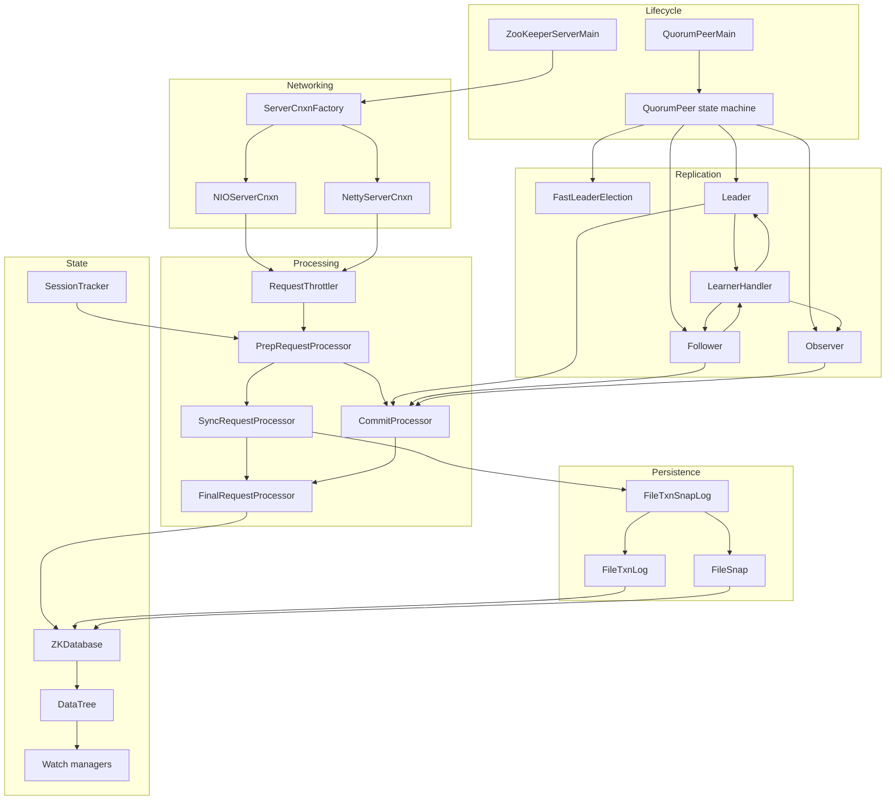

### Component responsibilities

| Block | Primary classes | Responsibility |
|---|---|---|
| Bootstrap | `ZooKeeperServerMain`, `QuorumPeerMain` | Parse configuration, initialize providers, persistence, networking, admin, and server lifecycle. |
| Peer state machine | `QuorumPeer` | Move between `LOOKING`, `LEADING`, `FOLLOWING`, and `OBSERVING`. |
| Election | `FastLeaderElection`, `QuorumCnxManager` | Exchange votes and select a leader based on epoch/zxid/server ID and quorum rules. |
| Client transport | `ServerCnxnFactory`, `NIOServerCnxn`, `NettyServerCnxn` | Frame protocol messages, manage connections, deliver replies and watch events. |
| Admission | `ZooKeeperServer`, `RequestThrottler` | Decode requests, authenticate, account, throttle, and enqueue work. |
| Preparation | `PrepRequestProcessor` | Validate paths, ACLs and versions; calculate the transaction and zxid-visible outstanding state. |
| Durability | `SyncRequestProcessor` | Append writes, batch fsync work, roll logs, and schedule snapshots. |
| Quorum commit | `Leader`, `LearnerHandler`, `Follower`, `CommitProcessor` | Propose, acknowledge, commit, and release requests in order. |
| Final execution | `FinalRequestProcessor` | Apply transactions, perform reads, register watches, build responses. |
| State | `ZKDatabase`, `DataTree`, `DataNode` | Hold the namespace, metadata, sessions, ephemerals, ACLs, quotas, and digest state. |
| Watches | `IWatchManager`, `WatchManager`, `WatchManagerOptimized` | Index, trigger, remove, and deliver watches. |
| Sessions | `SessionTrackerImpl` and quorum variants | Allocate, touch, expire, validate, and replicate session lifecycle. |
| Persistence | `FileTxnSnapLog`, `FileTxnLog`, `FileSnap` | Store transaction logs and snapshots; restore and replay state. |
| Operations | `ServerMetrics`, JMX beans, admin commands, four-letter commands | Expose health, diagnostics, metrics, and controlled administrative actions. |

## 4. Source-tree navigation

| Area | Path below `java/org/apache/zookeeper` |
|---|---|
| Core server | `server/` |
| Quorum, roles, election, Zab | `server/quorum/` |
| Logs and snapshots | `server/persistence/` |
| Watches | `server/watch/` |
| Authentication and ACL providers | `server/auth/` |
| HTTP admin server | `server/admin/` |
| Four-letter commands | `server/command/` |
| Metrics | `server/metric/`, `metrics/` |
| Client-side implementation | `ClientCnxn.java`, `ZooKeeper.java`, `ZKWatchManager.java` |

`java-filtered/` contains generated/version-template inputs rather than a second server
implementation.

## 5. Lifecycle: from process start to serving

### 5.1 Standalone mode

`ZooKeeperServerMain.runFromConfig` constructs the process:

1. Initialize metrics and authentication providers.
2. Open `FileTxnSnapLog`.
3. Construct `ZooKeeperServer`.
4. Start the admin server.
5. Configure and start one or two client connection factories.
6. Load snapshot/log state with `startdata()`.
7. Start sessions, processors, metrics, and monitoring with `startup()`.
8. Enter `RUNNING`.

`ZooKeeperServer.setupRequestProcessors()` installs:

```text
PrepRequestProcessor -> SyncRequestProcessor -> FinalRequestProcessor
```

**Code:** `server/ZooKeeperServerMain.java`,
`server/ZooKeeperServer.java:520`, `785`, `795`, `834`.

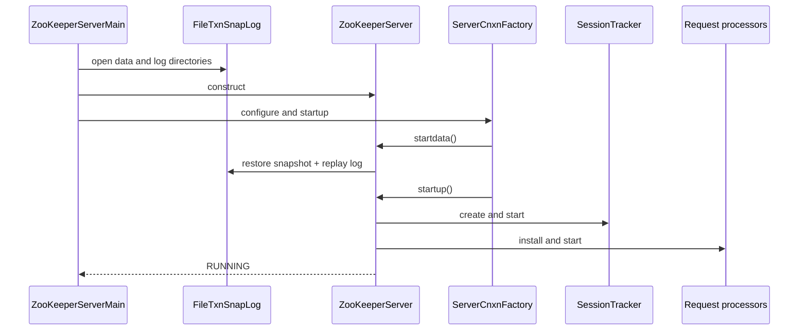

### 5.2 Quorum mode

`QuorumPeerMain` creates a `QuorumPeer`. Its main loop chooses behavior from the
current state:

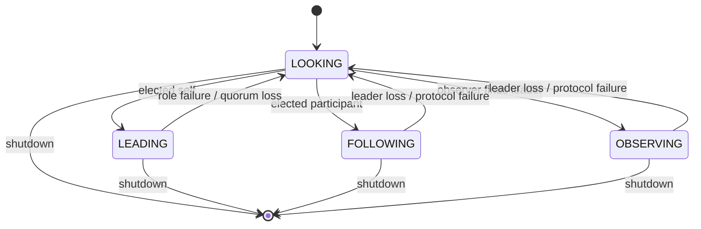

`FastLeaderElection.lookForLeader()` exchanges notifications containing the proposed
leader, zxid, election epoch, peer epoch, protocol version, and configuration data.

**Code:** `server/quorum/QuorumPeer.java:1486-1680`,
`server/quorum/FastLeaderElection.java:907`.

### 5.3 Becoming leader

`Leader.lead()` progresses through Zab discovery, synchronization, and broadcast:

1. Load local state and construct an epoch/zxid state summary.
2. Start accepting learner connections.
3. Establish a new epoch with a quorum.
4. issue `NEWLEADER`.
5. Wait for a quorum of synchronized learners.
6. Start the leader's ZooKeeper server and enter broadcast.

The leader cannot serve normal writes until the new epoch and synchronized quorum are
established.

**Code:** `server/quorum/Leader.java:632-860`.

### 5.4 Becoming follower or observer

A follower connects, sends `FOLLOWERINFO`, validates the epoch, synchronizes state,
and enters broadcast. It logs `PROPOSAL` packets, responds with `ACK`, then releases
the associated request on `COMMIT`.

An observer follows the same broad synchronization model but does not vote in the
write quorum. It receives committed information and can serve clients without
increasing the quorum's ACK fan-out.

**Code:** `server/quorum/Follower.java:71-225`,
`server/quorum/Observer.java`, `server/quorum/Learner.java:570`.

## 6. Client connections and sessions

### 6.1 Protocol admission

NIO and Netty read length-prefixed messages. Before initialization, the payload is a
`ConnectRequest`; afterward it contains a `RequestHeader` and operation-specific
record. Both transports dispatch to `ZooKeeperServer`.

**Code:** `server/NIOServerCnxn.java:300-448`,
`server/NettyServerCnxn.java:510`.

### 6.2 Session establishment

`ZooKeeperServer.processConnectRequest`:

- checks throttling and read-only compatibility;
- rejects a client whose last-seen zxid is ahead of the server;
- clamps the timeout to configured bounds;
- creates a new session or revalidates an existing one;
- temporarily disables reads while establishment is pending;
- sends a `ConnectResponse` and resumes traffic after validation.

A new session is not merely an in-memory connection attribute. `createSession`
submits a `createSession` transaction. `FinalRequestProcessor` calls
`finishSessionInit` only after that request reaches the final stage.

**Code:** `server/ZooKeeperServer.java:1089-1100`, `1137`,
`1467-1533`; `server/FinalRequestProcessor.java:228`.

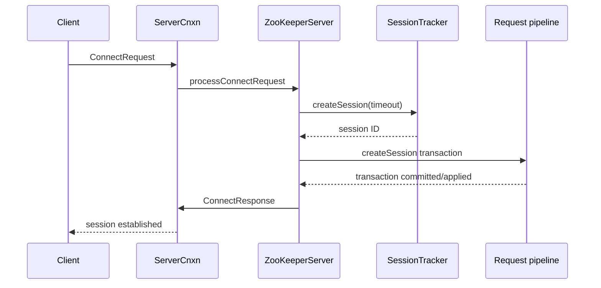

### 6.3 Expiration and ephemerals

`SessionTrackerImpl` groups sessions into expiry buckets. When a bucket expires, the
session is marked closing and the server submits a close-session request. Applying
that transaction calls `DataTree.killSession`, which deletes the session's ephemeral
paths and triggers the corresponding watches.

**Code:** `server/SessionTrackerImpl.java:158-185`, `261`;
`server/DataTree.java:951-955`, `1120-1162`.

## 7. Request-processing pipelines

The pipeline differs by role, but the stages preserve the same semantic separation.

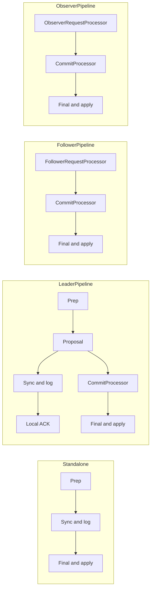

### 7.1 Admission and throttling

`ZooKeeperServer.submitRequest` and `enqueueRequest` route work through
`RequestThrottler`. Requests wait while restore is in progress and before processors
are ready.

**Code:** `server/ZooKeeperServer.java:1208-1239`,
`server/RequestThrottler.java:240`.

### 7.2 Preparation

`PrepRequestProcessor` performs:

- path, parent, node-type, and request-shape validation;
- authentication, ACL, and version checks;
- multi-operation preparation;
- quota and reconfiguration validation;
- transaction-header construction;
- tracking of uncommitted logical changes.

`outstandingChanges` lets later requests validate against earlier prepared writes
even before those writes have reached `DataTree`. Preparation is speculative;
authoritative mutation waits for commit.

### 7.3 Log synchronization

`SyncRequestProcessor` appends transaction-bearing requests, batches flushes, rolls
logs, schedules snapshots, and forwards work. Reads can pass through when no pending
write forces a flush.

**Code:** `server/SyncRequestProcessor.java:156-230`,
`server/persistence/FileTxnLog.java:250`, `275`.

### 7.4 Commit scheduling

`CommitProcessor` reconciles locally submitted requests with globally committed
requests. It permits controlled read concurrency but prevents writes from overtaking
their commit point.

### 7.5 Final execution

`FinalRequestProcessor` is the serving boundary:

- apply a transaction through `ZooKeeperServer.processTxn`;
- remove prepared outstanding-change records;
- perform read-side ACL checks;
- read from `DataTree`;
- register watches;
- create protocol responses and send them through `ServerCnxn`.

**Code:** `server/FinalRequestProcessor.java:112`, `145+`;
`server/ZooKeeperServer.java:1859-1923`;
`server/ZKDatabase.java:494-495`.

## 8. Read path

A normal read is local to the connected replica:

```text
connection decode
  -> request admission/throttling
  -> role-specific ordering gate
  -> FinalRequestProcessor
  -> ACL check
  -> DataTree lookup
  -> optional watch registration
  -> response
```

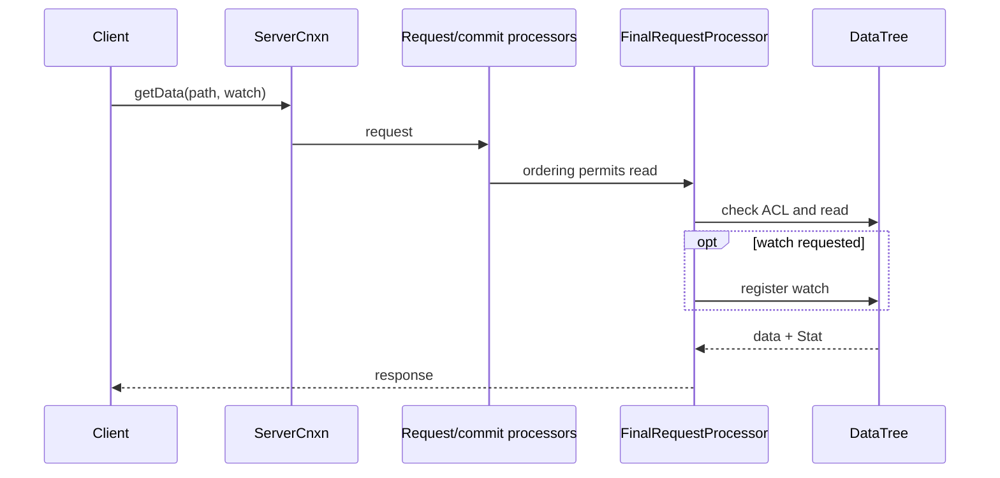

This gives ZooKeeper its read scalability, but it also explains why an arbitrary read
can observe a replica that has not yet applied the latest concurrent write. The
`sync` operation exists to establish the stronger ordering point described by the
paper.

## 9. Write path and Zab

### 9.1 End-to-end write

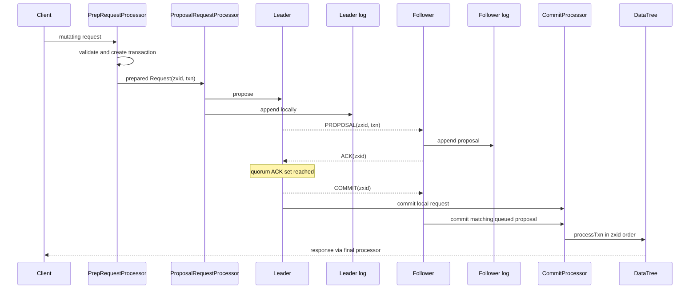

### 9.2 Proposal and quorum tracking

`Leader.propose` serializes the request into a `PROPOSAL`, associates quorum
verifiers, records it in `outstandingProposals`, and sends it to learners. Followers
log the proposal and ACK. `Leader.processAck` uses the proposal's quorum tracking to
decide when it may commit.

**Code:** `server/quorum/Leader.java:1054`, `1219`,
`1312-1333`; `server/quorum/AckRequestProcessor.java:46-47`.

### 9.3 Safety invariants visible in code

1. A leader establishes an epoch and synchronized quorum before broadcast.
2. Followers validate proposal zxid continuity.
3. A write is not released to final application until the required ACK set commits it.
4. A follower commit must match a queued proposal with the same zxid.
5. zxid rollover forces a new leadership/election boundary.
6. Reconfiguration proposals carry old/new quorum-verifier information and use
   `COMMITANDACTIVATE` where required.

## 10. Replicated state model

### 10.1 Namespace and metadata

`DataTree` maintains:

- the hierarchical znode tree and a full-path lookup map;
- data, versions, timestamps, zxids, and child metadata;
- ACLs through a reference-counted cache;
- session-to-ephemeral-path indexes;
- container and TTL node sets;
- quota information;
- data and child watch managers;
- last-processed zxid and digest history.

### 10.2 The authoritative mutation point

`DataTree.processTxn` switches on transaction type and calls operations such as
`createNode`, `deleteNode`, `setData`, ACL updates, multi-operation handling, and
session cleanup. Node mutation, metadata changes, ephemeral bookkeeping, quota
updates, digest changes, and watch triggers therefore occur at one ordered boundary.

**Code:** `server/DataTree.java:410-660`, `847-1027`.

### 10.3 zxid

A zxid is the replicated transaction order key. Conceptually it combines an epoch
with a per-epoch counter. It is used to:

- order proposals and commits;
- identify a server's last applied transaction;
- compare election/synchronization state;
- associate watch events with the mutation that triggered them;
- identify snapshot/log replay position.

## 11. Watches

The default `WatchManager` keeps both:

- `path -> watchers`;
- `watcher -> watched paths and modes`.

This supports event lookup and efficient cleanup when a connection closes.

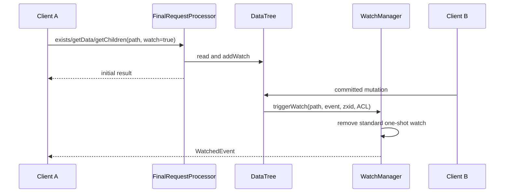

Standard watches are removed when triggered. Newer code also supports persistent and
persistent-recursive modes. Events are generated during committed transaction
application, not when a request is merely received.

**Code:** `server/watch/WatchManager.java:70-75`, `135-140`;
`server/DataTree.java:520-521`, `623-625`, `660`, `683-737`.

The exact client-observed ordering also depends on connection output queueing. The
server-side evidence establishes that event generation is tied to the applied zxid,
not that every network interleaving is visible from these classes alone.

## 12. Authentication, ACLs, and event visibility

`ProviderRegistry` loads authentication schemes. The snapshot includes digest, IP,
SASL, X.509, and extensible server-aware providers.

Write authorization occurs during preparation, preventing an unauthorized mutation
from entering the replication stream. Read authorization occurs before returning
data. Watch delivery also checks visibility so an event cannot become a side channel
for data the watcher may no longer access.

**Code:** `server/auth/ProviderRegistry.java`,
`server/ZooKeeperServer.java:1686-1730`, `2075-2120`,
`server/PrepRequestProcessor.java`, `server/FinalRequestProcessor.java`.

## 13. Persistence and recovery

`FileTxnSnapLog` composes `FileTxnLog` and `FileSnap`. Both use a versioned
`version-2` directory layout in this implementation.

### 13.1 Normal persistence

1. Prepared transactions reach `SyncRequestProcessor`.
2. `FileTxnLog.append` records them.
3. Batches are flushed according to queue/timeout conditions.
4. The log periodically rolls.
5. A snapshot captures `DataTree` and active session timeouts.

### 13.2 Restart recovery

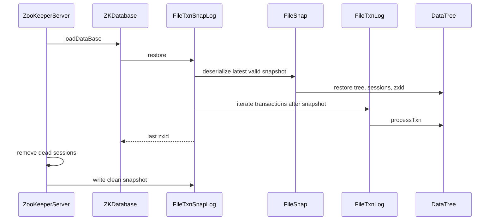

**Code:** `server/persistence/FileTxnSnapLog.java:253-301`, `430-475`,
`592-617`; `server/ZKDatabase.java:290`; `server/ZooKeeperServer.java:520-575`.

### 13.3 Learner synchronization

A recovering follower can receive:

- a transaction suffix/diff;
- truncation instructions for divergent history;
- a full snapshot;
- proposals and commits needed to reach the leader's state.

Only after `syncWithLeader` and `NEWLEADER` processing does it enter broadcast.

**Code:** `server/quorum/Learner.java:570-760`,
`server/quorum/Follower.java:107`.

## 14. Threading and concurrency

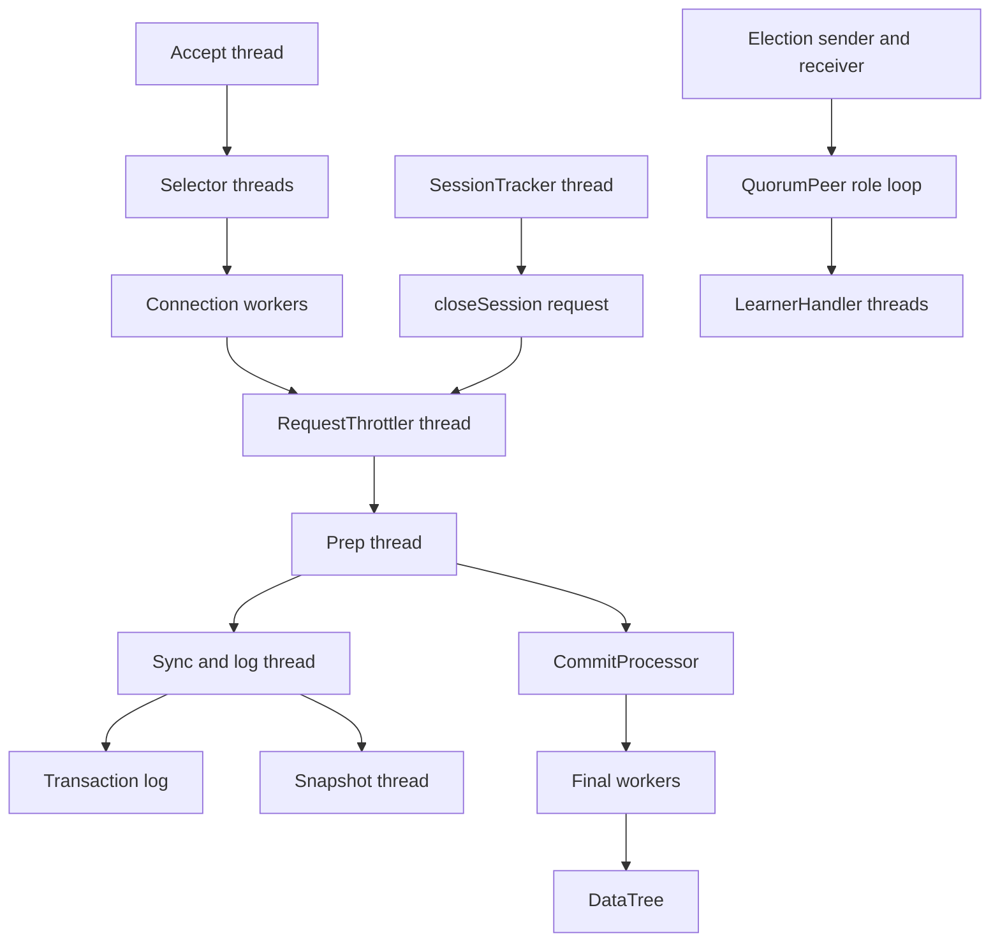

Important concurrency boundaries:

- request preparation is serialized;
- transaction application is ordered by zxid;
- reads may use commit/final worker concurrency;
- watch indexes synchronize mutation;
- session expiry is converted into pipeline work;
- selector wakeups coordinate network interest changes;
- snapshot concurrency is bounded;
- election messaging is separate from client request processing.

## 15. Dynamic reconfiguration

Membership changes are integrated into the replicated transaction model rather than
being an out-of-band local configuration edit:

1. `PrepRequestProcessor` validates feature enablement, ACL, current config version,
   membership rules, and absence of conflicting uncommitted reconfiguration.
2. The request becomes a transaction updating `ZooDefs.CONFIG_NODE`.
3. `Leader.propose` attaches the relevant quorum verifiers.
4. Zab commits and activates the configuration, using `COMMITANDACTIVATE` where
   necessary.

This makes the client-visible configuration node and the quorum protocol transition
part of the same ordered history.

**Code:** `server/PrepRequestProcessor.java:397-550`, `801-805`;
`server/quorum/Leader.java:1238`.

## 16. Failure and shutdown behavior

### Failure classes

| Failure | Response |
|---|---|
| Invalid startup/configuration/data directory | Explicit startup error and exit path. |
| Client disconnect or malformed I/O | Close and remove the connection; retain the session until expiry/reconnect rules decide otherwise. |
| Leader loss or quorum loss | Leave the active role and return to election. |
| Follower protocol inconsistency | End the role; unmatched/out-of-order state is not silently accepted. |
| Persistence failure | Escalate through critical-thread/server failure handling. |
| Session timeout | Replicate `closeSession`, delete ephemerals, trigger watches. |
| Full shutdown | Stop connections, processors, sessions, admin, metrics, and persistence resources. |
| Quorum role transition | Preserve/reuse the loaded database when appropriate rather than always clearing it. |

Server states include `INITIAL`, `RUNNING`, `ERROR`, `SHUTDOWN`, and `MAINTENANCE`.

## 17. Operational surfaces

The server exposes:

- `ServerMetrics` counters, gauges, summaries, and latency measurements;
- JMX beans for servers, peers, roles, learners, the data tree, and connections;
- an HTTP admin server implemented by `JettyAdminServer`;
- four-letter commands such as `ruok`, `stat`, `srvr`, `cons`, `conf`, `mntr`,
  `dump`, `dirs`, and `isro`;
- audit logging and JVM pause monitoring.

These paths observe or administer the server but do not replace the ordinary client
protocol or replicated mutation path.

## 18. White paper claims mapped to source evidence

**Paper:** *ZooKeeper: Wait-free coordination for Internet-scale systems*, Patrick
Hunt, Mahadev Konar, Flavio P. Junqueira, and Benjamin Reed, USENIX ATC 2010.

Page numbers below use the paper's printed page numbers. The evidence column names
the current implementation mechanism; source inspection supports the mechanism but
is not, by itself, a formal proof of a distributed guarantee.

| Paper claim | Paper location | Current source evidence | Assessment |
|---|---|---|---|
| ZooKeeper exposes a file-system-like hierarchical namespace of znodes for coordination. | §2, §2.1, pp. 2-3 | `server/DataTree.java:95-180`, create/read handlers in `FinalRequestProcessor` and `PrepRequestProcessor` | Directly realized. |
| Znodes carry data and metadata including versions, timestamps, and transaction IDs. | §2.1, p. 3 | `DataNode`, `DataTree.createNode` at `410-520`, stat construction near `1967-1979` | Directly realized; current metadata is richer. |
| Ephemeral znodes belong to sessions and disappear when the session ends. | §2.1, p. 3 | Ephemeral index in `DataTree`; close-session handling at `951-955`; `killSession` at `1120-1162` | Directly realized through a replicated close-session transaction. |
| Sequential creation appends a monotonically increasing sequence value. | §2.1, p. 3 | Create preparation in `PrepRequestProcessor`; parent/version state and final create in `DataTree.createNode` | Realized; current code also supports container and TTL variants. |
| Sessions survive transient connection loss and expire after a negotiated timeout. | §2.2, p. 3 | `ZooKeeperServer.processConnectRequest:1467-1533`, `SessionTrackerImpl:158-185,261` | Server side directly realized; reconnect policy also involves client code. |
| Watches provide asynchronous notification and are one-shot in the original API. | §2.3, p. 3 | `WatchManager.addWatch:70-75`, `triggerWatch:135-207`; mutation triggers in `DataTree:520-660` | Directly realized; persistent watch modes are later extensions. |
| Watch events are associated with ordered state transitions. | §2.3, p. 3 | `DataTree` triggers during `processTxn`; `WatchManager.triggerWatch` receives the mutation zxid | Strong server-side evidence; complete client-observed ordering also depends on delivery code. |
| The API includes create, delete, exists, get/set data, get children, sync, and ACL operations. | §2.4, pp. 3-4 | Operation handling in `PrepRequestProcessor` and `FinalRequestProcessor` | Directly realized with a much larger modern API. |
| Updates are linearizable: all replicas process them in one total order. | §2.4, p. 4 | zxid assignment/ordering, `Leader.propose/processAck/commit`, follower continuity checks, `CommitProcessor`, `DataTree.processTxn` | Architecture directly implements the claim; formal linearizability requires protocol reasoning beyond line mapping. |
| Requests from one client preserve FIFO order. | §2.4, p. 4 | Per-connection decode/dispatch, ordered request queues, serial preparation, cxid/request matching | Server path supports it; retry semantics also involve `ClientCnxn`. |
| Reads can be served by any replica and may be stale relative to a concurrent write. | §2.4, p. 4 | Local read execution in `FinalRequestProcessor`; follower/observer/read-only server pipelines | Directly realized. |
| `sync` provides an ordering point before subsequent reads. | §2.4, p. 4 | `SyncRequest` handling in `FinalRequestProcessor` plus role-specific commit sequencing | API and mechanism present; the end-to-end guarantee spans client and server behavior. |
| Zab atomically broadcasts state-changing requests in the same order. | §3, pp. 4-5 | `Leader`, `LearnerHandler`, `Follower`, `AckRequestProcessor`, `CommitProcessor` | Directly realized; code has evolved beyond the paper's presentation. |
| A leader proposes, followers acknowledge, and a quorum is required to commit. | §3, pp. 4-5 | `Leader.propose:1312+`, `processAck:1054`, `commit:1219`; follower `PROPOSAL`/`COMMIT` handling | Directly realized. |
| Followers serve reads while the leader serializes updates. | §3, pp. 4-5 | `FollowerZooKeeperServer`, `FollowerRequestProcessor`, `CommitProcessor`; leader proposal pipeline | Directly realized. |
| A new leader establishes a new epoch and synchronizes replicas before broadcast. | §3, pp. 4-5 | `Leader.lead:632-860`, `Follower.followLeader:71-145`, `Learner.syncWithLeader:570+` | Directly realized. |
| Requests move through preparation, atomic broadcast, commit, application, and response stages. | §4, p. 5 | Role-specific processor chains, `Leader`, `FinalRequestProcessor` | Directly visible as the main server architecture. |
| Replicas converge by applying the same committed transaction stream. | §4, p. 5 | `ZooKeeperServer.processTxn:1859-1923`, `ZKDatabase.processTxn:494-495`, `DataTree.processTxn:847-1027` | Directly realized. |
| Logs and snapshots recover server state after failure. | §4, pp. 5-6 | `FileTxnSnapLog.restore:253+`, `FileSnap`, `FileTxnLog`, `ZKDatabase:290`, `ZooKeeperServer.loadData:520+` | Directly realized with additional digest and validation safeguards. |
| A lagging/recovering replica receives a snapshot and/or transaction suffix. | §3-4, pp. 5-6 | `Learner.syncWithLeader`, `LearnerHandler`, snapshot/diff/truncation packet processing | Directly realized. |
| If the leader fails, the ensemble elects another leader. | §3, p. 5 | `QuorumPeer` state loop and `FastLeaderElection.lookForLeader:907` | Directly realized; modern election code is newer than the paper. |
| A slow client should not block other clients ("wait-free coordination"). | Abstract, §1, pp. 1-2 | Network workers, queues, processor separation, throttling, and local reads | Design goal supported by mechanisms, not a line-level proof or the strict shared-memory definition of wait-free. |
| Read throughput scales because replicas serve reads locally. | §5, pp. 6-7 | Follower/observer local pipelines and `CommitProcessor` read/write separation | Mechanism present; historical benchmark numbers are not source-verifiable. |
| Batching and pipelining improve throughput. | §4-5, pp. 5-7 | `SyncRequestProcessor` batching/flush logic; proposal queues and learner forwarding | Direct mechanism present. |
| Periodic snapshots bound recovery work and log growth. | §4-5, pp. 5-7 | snapshot thresholds in `SyncRequestProcessor:146-193`; `ZooKeeperServer.takeSnapshot:554-575` | Directly realized. |
| The reported throughput and latency measurements characterize the implementation. | §5, pp. 6-7 | Metrics instrumentation exists, but no source line can reproduce the paper's experimental environment or numbers | Not directly verifiable from source; requires benchmark reproduction. |

### Paper-to-code caveats

1. **Formal guarantees are system properties.** Linearizable writes, FIFO ordering,
   watch ordering, and session behavior emerge from multiple server and client
   components plus the protocol's failure assumptions.
2. **Some claims are client-side.** Server selection, reconnect loops, retry behavior,
   callback dispatch, and parts of watch/session state live in `ClientCnxn`,
   `ZKWatchManager`, and `ZooKeeper`, not solely under `server/`.
3. **The implementation has expanded.** Observers, dynamic reconfiguration, local
   sessions, persistent watches, multi-operations, TTL/container nodes, response
   caches, digest validation, TLS/SASL, metrics, and multiple transports postdate the
   paper.
4. **Historical performance results need historical workloads.** Source code shows
   batching, local reads, metrics, and persistence mechanisms, but cannot establish
   the paper's measured numbers.

## 19. End-to-end mental model

### A read

```text
client -> local replica -> ordering gate -> ACL/read DataTree
       -> optional watch registration -> response
```

### A write

```text
client -> validate/prepare -> leader proposal -> follower durable ACKs
       -> quorum commit -> ordered DataTree application -> watches -> response
```

### A session expiration

```text
expiry bucket -> closeSession request -> replicated commit
              -> delete ephemerals -> trigger watches
```

### A restart

```text
latest valid snapshot -> replay later transactions -> restore sessions/zxid
                      -> standalone serving or quorum election/synchronization
```

### A leader failure

```text
active role ends -> LOOKING -> elect highest suitable history/epoch
                 -> establish new epoch -> synchronize quorum -> broadcast
```

## 20. Suggested code-reading path

For a progressive source walkthrough:

1. `server/ZooKeeperServerMain.java`
2. `server/ZooKeeperServer.java`
3. `server/NIOServerCnxn.java` or `server/NettyServerCnxn.java`
4. `server/PrepRequestProcessor.java`
5. `server/SyncRequestProcessor.java`
6. `server/FinalRequestProcessor.java`
7. `server/ZKDatabase.java`
8. `server/DataTree.java`
9. `server/SessionTrackerImpl.java`
10. `server/watch/WatchManager.java`
11. `server/quorum/QuorumPeer.java`
12. `server/quorum/FastLeaderElection.java`
13. `server/quorum/LeaderZooKeeperServer.java`
14. `server/quorum/Leader.java`
15. `server/quorum/LearnerHandler.java`
16. `server/quorum/Follower.java`
17. `server/quorum/CommitProcessor.java`
18. `server/persistence/FileTxnSnapLog.java`
19. `server/persistence/FileTxnLog.java`
20. `server/persistence/FileSnap.java`

This order starts with lifecycle and one request, then introduces the state machine,
and only afterward expands into distributed replication and recovery.
