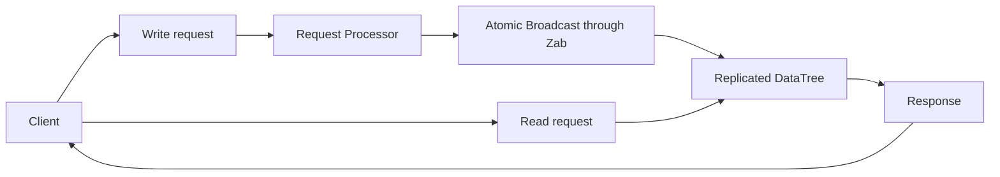
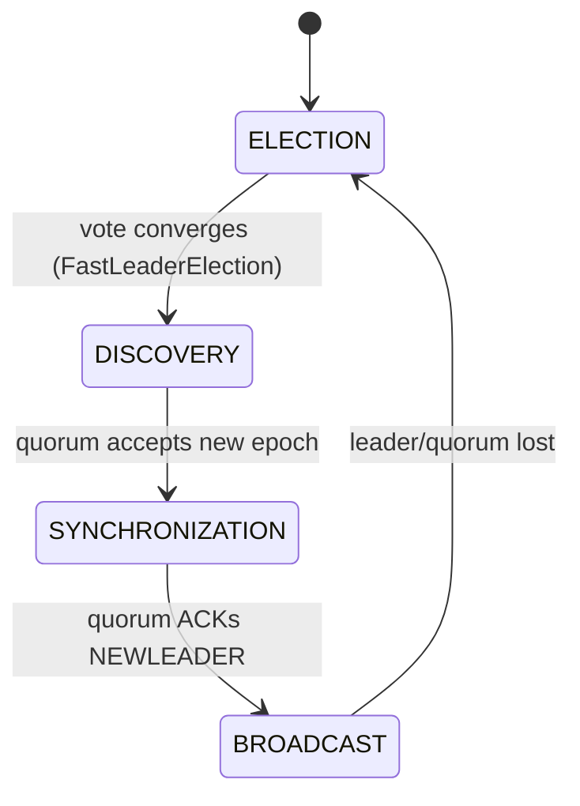
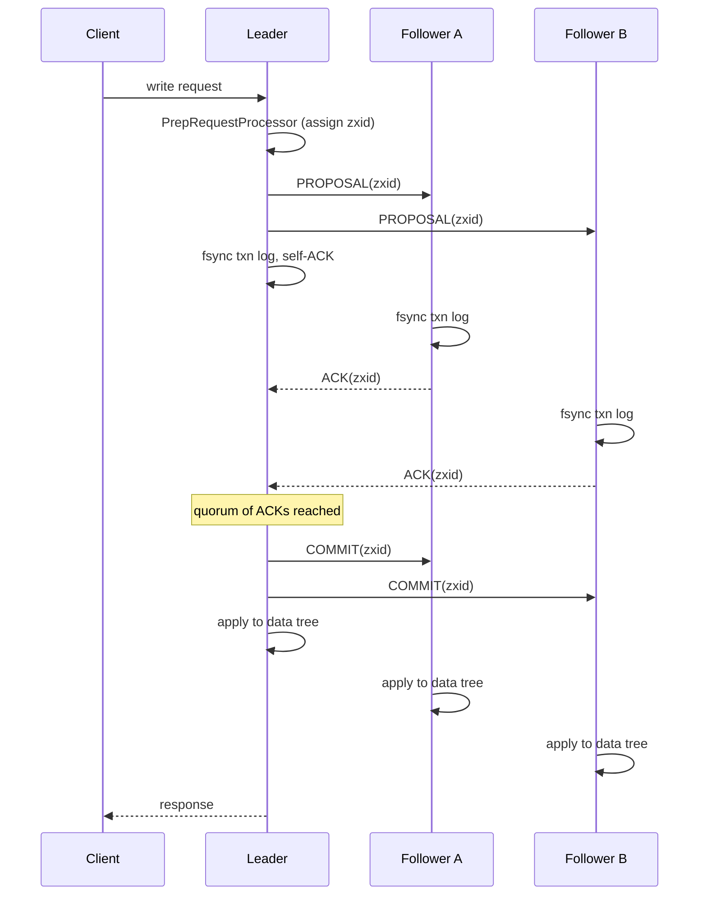
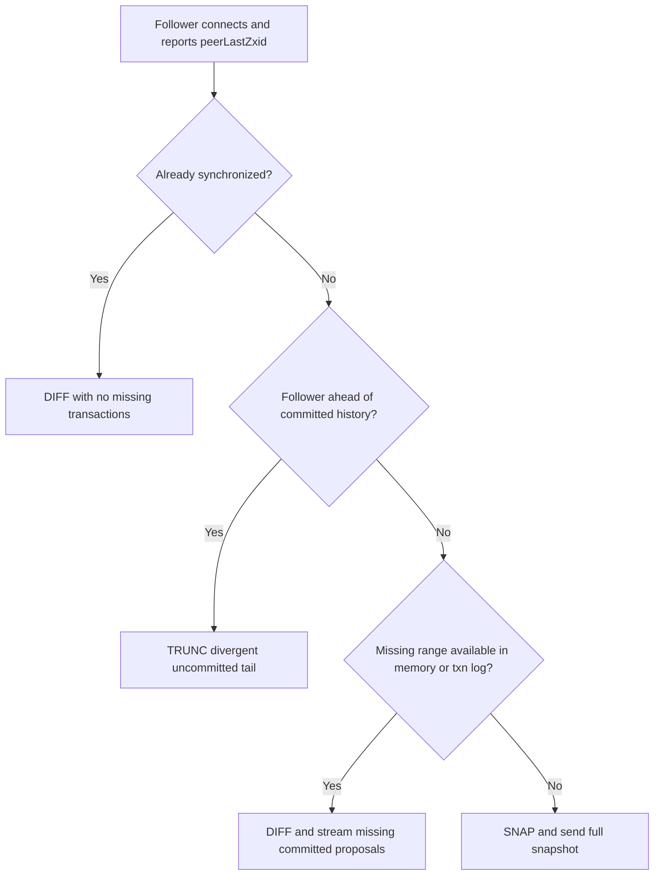

# Zab: ZooKeeper Atomic Broadcast — A Technical Guide

> Sources used
> - **[PAPER]** = local file `/mnt/d/lhub/MIT_Distributed_Systems/papers/zookeeper.pdf` — this is the **USENIX ATC 2010** paper *"ZooKeeper: Wait-free coordination for Internet-scale systems"* (Hunt, Konar, Junqueira, Reed). It describes ZooKeeper's API/guarantees and treats Zab mostly as a black-box "atomic broadcast" component (it explicitly says leader/follower protocol detail is "out of scope", p.8, footnote 1). It cites the dedicated Zab paper as reference **[24] B. Reed, F. P. Junqueira, "A simple totally ordered broadcast protocol," LADIS'08**, which is *not* the file on disk.
> - **[DOC]** = `zookeeperInternals.html` (Apache ZooKeeper current docs, fetched live) — the closest authoritative public description of the Zab algorithm itself (two logical phases: *Leader Activation* and *Active Messaging*), plus quorum/consistency semantics.
> - **[SRC]** = server source tree at `/mnt/d/lhub/source/zookeeper_server/main/java/org/apache/zookeeper/server/quorum/**` (modern ZooKeeper, post ZOOKEEPER-1419 "Zab 1.0"). All file:line citations below are exact ranges I read from this tree.
> - No `.org` files were read or searched, per instructions.
> - **Public/official sources (fetched live for this revision)** are listed in full in **§20 Bibliography**, with each one tagged **[NORMATIVE]** (current, authoritative, maintained by the Apache ZooKeeper project or the original protocol designers) or **[SECONDARY]** (community/third-party explanation, useful for intuition but not authoritative).

## 0. Public Resources Used (quick index — see §20 for full annotated bibliography)

| Tag | Source | URL |
|---|---|---|
| **[NORMATIVE]** | Apache ZooKeeper — ZooKeeper Internals (Atomic Broadcast, Quorums, Consistency Guarantees) | https://zookeeper.apache.org/doc/current/zookeeperInternals.html |
| **[NORMATIVE]** | Apache ZooKeeper — Administrator's Guide (ensemble sizing, odd-server rationale, deployment) | https://zookeeper.apache.org/doc/current/zookeeperAdmin.html |
| **[NORMATIVE]** | Apache ZooKeeper — Programmer's Guide (zxid, sessions, ephemeral nodes, `sync`, watches) | https://zookeeper.apache.org/doc/current/zookeeperProgrammers.html |
| **[NORMATIVE]** | Apache ZooKeeper — Dynamic Reconfiguration Guide | https://zookeeper.apache.org/doc/current/zookeeperReconfig.html |
| **[NORMATIVE]** | Apache ZooKeeper — Recipes and Solutions (leader election, locks, barriers built atop Zab ordering) | https://zookeeper.apache.org/doc/current/recipes.html |
| **[NORMATIVE, original paper]** | Hunt, Konar, Junqueira, Reed — *"ZooKeeper: Wait-free coordination for Internet-scale systems"*, USENIX ATC 2010 (= local `zookeeper.pdf`) | https://www.usenix.org/legacy/event/atc10/tech/full_papers/Hunt.pdf |
| **[NORMATIVE, original Zab paper]** | Reed, Junqueira — *"A simple totally ordered broadcast protocol"*, LADIS 2008 (2-phase description; ACM DOI is canonical, mirror PDF given since ACM is paywalled) | ACM DOI: https://doi.org/10.1145/1529974.1529978 · mirror: https://github.com/martyanov/papers/blob/master/consensus/a_simple_totally_ordered_broadcast_protocol.pdf |
| **[NORMATIVE, formal Zab paper]** | Junqueira, Reed, Serafini — *"Zab: High-performance broadcast for primary-backup systems"*, IEEE/IFIP DSN 2011 (the paper that formalizes the 3-phase discovery/synchronization/broadcast model + correctness proof) | IEEE DOI: https://doi.org/10.1109/DSN.2011.5958223 · mirror: https://github.com/jeffrey-xiao/papers/blob/master/consensus/zab-high-performance-broadcast-for-primary-backup-systems.pdf |
| **[NORMATIVE, reconfiguration paper]** | Shraer, Reed, Malkhi, Junqueira — *"Dynamic Reconfiguration of Primary/Backup Clusters"*, USENIX ATC 2012 (algorithm behind §15) | https://www.usenix.org/conference/atc12/technical-sessions/presentation/shraer |
| **[SECONDARY]** | Kazoo (Python client) — official docs | https://kazoo.readthedocs.io/en/latest/ and .../implementation.html |

Where the **original 2008 Zab design** (2-phase: Leader Activation + Active Messaging, as in [DOC]) differs from **what today's source code implements** (explicit 3-phase state machine: `DISCOVERY → SYNCHRONIZATION → BROADCAST`, i.e. "Zab 1.0"), each section calls this out with **[ORIGINAL]** vs **[MODERN]** tags.

---

## 1. Why Zab Exists

ZooKeeper's whole value proposition is a small, wait-free, file-system-like API (`create/setData/getData/delete/sync`) backed by an **in-memory replicated database** that must survive server crashes without losing acknowledged writes and without ever showing clients an inconsistent history. [PAPER, p.8] states the architecture directly:

> "If such a request requires coordination among the servers (write requests), then they use an agreement protocol (an implementation of atomic broadcast), and finally servers commit changes to the ZooKeeper database fully replicated across all servers of the ensemble."

Generic atomic broadcast (e.g. Paxos-style single-value consensus repeated per slot) is *not* sufficient by itself for ZooKeeper's needs, because ZooKeeper's semantics (FIFO client order, "read your writes," `sync`) depend on the *stream* of state changes being applied **in the same total order, gap-free, on every replica, exactly reflecting real commit order**, and on a **fast, unambiguous way to know which proposals from a crashed leader are safe to keep**. [PAPER, p.8] explicitly says:

> "Because state changes depend on the application of previous state changes, Zab provides *stronger* order guarantees than regular atomic broadcast... changes broadcast by a leader are delivered in the order they were sent and all changes from previous leaders are delivered to an established leader before it broadcasts its own changes."

Zab is therefore a **primary-backup, crash-recovery atomic broadcast protocol purpose-built to also implement a replicated state machine**, not a general-purpose consensus box: it bundles leader election, log recovery (streaming missing history / truncating divergent history / full snapshot), and ordered broadcast into a single system tuned for a single writer (the leader) and idempotent, prefix-ordered replay.

## 2. Relationship to Atomic Broadcast and Replicated State Machines

- The **replicated state machine (RSM)** approach (Schneider's tutorial, cited as [26] in [PAPER]) says: if every replica starts in the same state and applies the same deterministic operations in the same order, all replicas stay consistent. ZooKeeper's data tree is the state machine; Zab is the mechanism that gets every replica the same ordered operation log.
- **[DOC]** frames Zab's guarantees exactly in these RSM-supporting terms: *reliable delivery*, *total order*, *causal order* — the three properties a broadcast protocol must give an RSM.
- Crucially, Zab's ordering guarantee is stronger than "total order" alone: it guarantees a **prefix** relationship across leader changes — a new leader's committed history is always a superset-prefix of every prior committed history (see §9). This is what lets ZooKeeper avoid re-running a full consensus round per operation; the leader can just stream a numbered sequence.
- Architecturally [PAPER, Fig. 4, p.8]: `Request Processor → Atomic Broadcast (txn) → Replicated Database`, with reads bypassing broadcast entirely and going straight to the local replicated database.



## 3. zxid Structure

**[SRC]** `org/apache/zookeeper/server/util/ZxidUtils.java:21-31` (full file, 36 lines):

```java
public static long getEpochFromZxid(long zxid) {
    return zxid >> 32L;
}
public static long getCounterFromZxid(long zxid) {
    return zxid & 0xffffffffL;
}
public static long makeZxid(long epoch, long counter) {
    return (epoch << 32L) | (counter & 0xffffffffL);
}
```

A zxid is a **64-bit long**: high 32 bits = **epoch**, low 32 bits = **counter**. [DOC] confirms: *"The epoch number represents a change in leadership... the leader simply increments the zxid to obtain a unique zxid for each proposal."* This gives a globally unique, monotonically-increasing, totally-ordered id per proposal, and lets any server tell at a glance which leader-epoch produced a given transaction. Counter rollover is treated as an operational event: **[SRC]** `Leader.java:1305` forces re-election ("zxid lower 32 bits have rolled over, forcing re-election, and therefore new epoch start") rather than allowing wraparound corruption.

## 4. Epochs

An epoch identifies one leader's reign. Each time a new leader is elected it must obtain an epoch number **strictly greater** than any epoch it has seen, then get a **quorum of followers to accept** that epoch before proposing anything.

**[SRC]** `Leader.java:1469-1503` (`getEpochToPropose`):
```java
public long getEpochToPropose(long sid, long lastAcceptedEpoch) throws InterruptedException, IOException {
    synchronized (connectingFollowers) {
        if (!waitingForNewEpoch) { return epoch; }
        if (lastAcceptedEpoch >= epoch) { epoch = lastAcceptedEpoch + 1; }
        if (isParticipant(sid)) { connectingFollowers.add(sid); }
        QuorumVerifier verifier = self.getQuorumVerifier();
        if (connectingFollowers.contains(self.getMyId()) && verifier.containsQuorum(connectingFollowers)) {
            waitingForNewEpoch = false;
            self.setAcceptedEpoch(epoch);
            connectingFollowers.notifyAll();
        } else { /* wait, with initLimit*tickTime timeout */ }
        return epoch;
    }
}
```
Each connecting learner reports its own last accepted epoch; the (candidate) leader bumps its proposed epoch above the max reported so far, and only finalizes the new epoch once a quorum of learners (including itself) have "connected" under it. This is the FastLeaderElection **election epoch** (`Vote.electionEpoch`) plus the separate Zab **acceptedEpoch/currentEpoch** persisted in `acceptedEpoch`/`currentEpoch` files on disk — two related but distinct epoch counters (see §16 misconceptions).

## 5. Leader Election vs. Zab's Own Phases

**Leader election (FastLeaderElection)** is a separate sub-protocol that only needs to produce *a* server most followers agree to try, with the property (per [DOC]): *"The leader has seen the highest zxid of all the followers"* among those that voted for it, and *"a quorum of servers have committed to following the leader"* (checked, not assumed — Zab re-verifies this itself). **[SRC]** `FastLeaderElection.java:717-728` (`totalOrderPredicate`) implements the vote-comparison rule: prefer higher election epoch, then higher (zxid, then serverId) — i.e. **whoever has the most recent committed history wins ties by data recency, not just by id**.

Election's job ends once a `LOOKING` server decides on a `Vote`. **Zab itself** then runs three phases, encoded directly in the source as an explicit state machine:

**[SRC]** `QuorumPeer.java:589-596`:
```java
public enum ZabState {
    ELECTION,
    DISCOVERY,
    SYNCHRONIZATION,
    BROADCAST
}
```

- **[MODERN]** This 4-state enum (`ELECTION` + Zab's 3 phases) is exactly the "Zab 1.0" formalization (discovery / synchronization / broadcast) from the academic Zab paper (Junqueira, Reed, Serafini, DSN 2011) — a refinement of what [DOC]/[ORIGINAL] describes only as two phases ("Leader Activation" covers discovery+synchronization; "Active Messaging" = broadcast).
- **DISCOVERY** = the epoch-negotiation step (`getEpochToPropose`/`waitForEpochAck`, §4).
- **SYNCHRONIZATION** = leader streams DIFF/TRUNC/SNAP + the `NEWLEADER` proposal, learners ACK it (§8, §11).
- **BROADCAST** = normal operation: proposal → ack → commit (§7).

Transition evidence: **[SRC]** `Leader.java:640-716` sets `DISCOVERY` at the top of `lead()`, then `SYNCHRONIZATION` right after `waitForEpochAck` succeeds (`Leader.java:711`); **[SRC]** `Follower.java:83-102` mirrors this: `DISCOVERY` before `registerWithLeader`, `SYNCHRONIZATION` before `syncWithLeader`, `BROADCAST` right after `syncWithLeader` returns.



## 6. Leader Establishment (Discovery → Synchronization)

**[SRC]** `Leader.java:632-716` (`lead()`), condensed:

1. `zk.loadData()` restores local snapshot/log.
2. `epoch = getEpochToPropose(myId, acceptedEpoch)` — DISCOVERY (§4).
3. `zk.setZxid(makeZxid(epoch, 0))` — new epoch's first zxid has counter 0.
4. Build `NEWLEADER` proposal: `new QuorumPacket(NEWLEADER, zk.getZxid(), null, null)` (`Leader.java:663`).
5. `waitForEpochAck(myId, leaderStateSummary)` — blocks until a quorum of learners have sent their `(currentEpoch, lastZxid)` state summaries and agreed to the new epoch (`Leader.java:1515+`).
6. `self.setCurrentEpoch(epoch)`, state → **SYNCHRONIZATION** (`Leader.java:712-713`).
7. `waitForNewLeaderAck(myId, zk.getZxid())` — blocks until a quorum has ACKed the `NEWLEADER` proposal *after* they've synced their logs (§11).
8. Only then does the leader start accepting/proposing new client writes → state moves to **BROADCAST**.

Per **[DOC]**: *"A new leader will not accept new proposals until the NEWLEADER proposal has been COMMITTED,"* and *"If leader election terminates erroneously... the NEWLEADER proposal will not be committed since the leader will not have quorum... leader and any remaining followers will timeout and go back to leader election."* This is the safety net that makes a bad/stale election harmless.

## 7. Proposal → Durable Log → ACK Quorum → COMMIT → Apply

**[SRC]** pipeline wiring, `LeaderZooKeeperServer.java:65-70` (`setupRequestProcessors`) and `ProposalRequestProcessor.java:70-88`:

```
PrepRequestProcessor -> ProposalRequestProcessor -> CommitProcessor -> ... -> FinalRequestProcessor
                              |                                (applies to data tree)
                              +--> SyncRequestProcessor (fsync to txn log) -> AckRequestProcessor (self-ACK)
                              +--> Leader.propose(request)  (fan out PROPOSAL to all LearnerHandlers)
```

- `ProposalRequestProcessor.processRequest` (`ProposalRequestProcessor.java:70-88`): forwards to `nextProcessor` (commit path), then for any request with a transaction header calls `zks.getLeader().propose(request)` (broadcasts `PROPOSAL` to followers) **and** `syncProcessor.processRequest(request)` (durably logs locally, then self-ACKs via `AckRequestProcessor`).
- `AckRequestProcessor.processRequest` (`AckRequestProcessor.java:39-48`): after the local `SyncRequestProcessor` has fsynced the txn, forwards an ACK to `leader.processAck(myId, zxid, null)` — **the leader's own vote counts, and only after its own log write completes.**
- On followers, the mirrored path is `FollowerRequestProcessor → CommitProcessor`, plus `SyncRequestProcessor → SendAckRequestProcessor` (`FollowerZooKeeperServer.java:67-74`): `SendAckRequestProcessor.processRequest` (`SendAckRequestProcessor.java:33-45`) writes a `Leader.ACK` `QuorumPacket` back over the socket **only after the local fsync completes** — the durable-log-then-ACK ordering is structural, not incidental.
- `Leader.processAck`/`tryToCommit` (`Leader.java:844-1035`): tracks `outstandingProposals` (a `ConcurrentMap<zxid, Proposal>`); a `Proposal` `hasAllQuorums()` once acks from a majority (per the active `QuorumVerifier`) are recorded; `tryToCommit` refuses to commit `zxid` until `zxid-1` is no longer outstanding (**strict commit-order enforcement**, `Leader.java:978-991`), then sends `COMMIT` to all learners (`commit(zxid)`/`inform(p)`) and hands the request to `zk.commitProcessor.commit(p.request)` for local apply.
- On the follower, `Follower.processPacket` (`Follower.java:154-231`): `Leader.PROPOSAL` → deserialize txn, `fzk.logRequest(...)` (queues for local durable log + pending apply); `Leader.COMMIT` → `fzk.commit(qp.getZxid())` (releases the transaction to be applied to the data tree in order).



Note the leader can reply to the client as soon as *it* has applied the commit locally (2-phase-commit-like, per [DOC]: *"ZooKeeper messaging operates similar to a classic two-phase commit"*); it doesn't wait for followers to finish applying, only for a quorum to have **durably logged** (acked) the proposal.

## 8. Follower and Observer Roles

- **Follower** (`Follower.java`): a full voting participant. Persists every proposal to its own transaction log (durability contributes to quorum), sends ACKs, applies COMMITs, and can become leader via election. `QuorumPeer.LearnerType.PARTICIPANT`.
- **Observer** (`Observer.java`, `ObserverZooKeeperServer.java`, `ObserverRequestProcessor.java`): receives committed transactions through `INFORM` (or `INFORMANDACTIVATE` for reconfiguration), but **does not ACK proposals and never counts toward quorum**. `Observer.processPacket` explicitly ignores ordinary `PROPOSAL` and `COMMIT` packets and applies `INFORM` packets instead. `QuorumMaj` counts only `votingMembers` (`QuorumMaj.java:70-77`, `86-93`); `LearnerType.OBSERVER` servers belong to `observingMembers`. Observers scale read throughput and geographic fan-out without increasing the write quorum. They forward writes toward a leader or learner master but do not participate in the ACK/commit decision.
- Both are "Learners" (`Learner.java` — shared base class handling `registerWithLeader`, `syncWithLeader`, socket I/O to the leader).

## 9. Core Invariants

Per **[DOC]** ("Summary" section) and reflected structurally in **[SRC]**:

- **Prefix (a.k.a. leader-completeness)**: *"a new leader has seen all committed proposals from the previous epoch since it has seen the highest zxid from a quorum of servers."* Enforced by FastLeaderElection's `totalOrderPredicate` (§5) plus DISCOVERY's requirement that the new epoch dominates every learner's last accepted epoch (§4). Any uncommitted proposals a new leader sees from a stale epoch get re-proposed/committed (via TRUNC/DIFF, §11) before the leader accepts new work — *"any uncommitted proposals from a previous epoch seen by a new leader will be committed by that leader before it becomes active."*
- **Order (total + causal)**: FIFO TCP channels + strictly increasing zxid assignment + `tryToCommit`'s `zxid-1` outstanding-check (`Leader.java:978-981`) guarantee proposals are sent, acked, and committed in the same order everywhere.
- **Agreement**: nothing is committed without acks from a `QuorumVerifier`-defined majority (`Proposal.hasAllQuorums()`/`QuorumMaj.containsQuorum`, `QuorumMaj.java:135-138`).
- **Durability**: an ACK is only sent after the transaction is fsynced to the local write-ahead log (`SyncRequestProcessor` precedes both `AckRequestProcessor` and `SendAckRequestProcessor` in every pipeline, §7). Since agreement requires a quorum of *durable* acks, a committed transaction survives the crash of any minority.

## 10. Crash / Recovery Scenarios

- **Follower crashes and restarts**: rejoins as `LOOKING`, re-elects (typically re-affirms current leader if it's still up), then does DISCOVERY+SYNCHRONIZATION against the leader; leader chooses DIFF/TRUNC/SNAP based on how far behind it is (§11).
- **Leader crashes**: remaining servers detect the socket break (`LearnerHandler` ping/timeout) or election-epoch/heartbeat timeout, go to `LOOKING`, run FastLeaderElection; the new leader is guaranteed (by `totalOrderPredicate`) to be a server holding the highest zxid among responsive voters, so it already has every committed proposal.
- **Old leader revives after a new leader was elected ("split brain")**: the old leader still thinks it's `LEADING` but can no longer get a live quorum of `LearnerHandler` acks (its old followers have since reconnected to the new leader) — `Leader.processAck`/timeouts eventually make it `shutdown()`/revert to `LOOKING`. Per [DOC]'s "Isn't this just Paxos?" discussion, Zab does **not** rely on a fencing token or lease to detect this; it relies on the impossibility of two disjoint quorums coexisting.
- **Follower has extra, uncommitted proposals from a stale epoch (leader-only-locally-logged txns)**: `syncFollower` detects `peerLastZxid > maxCommittedLog` and sends `TRUNC` to roll the follower's log back to the leader's `maxCommittedLog` (`LearnerHandler.java:836-865`) — these proposals were never committed (no quorum durability) so discarding them is safe, exactly matching [DOC]'s "corner case" discussion.
- **Quorum permanently lost (fewer than majority alive)**: no election can complete, no NEWLEADER can be acked — the ensemble correctly refuses to make progress (unavailable but never incorrect).

## 11. Synchronization Choices: DIFF / TRUNC / SNAP

**[SRC]** `QuorumPeer.java:598-604` (enum `SyncMode { NONE, DIFF, SNAP, TRUNC }`) and the decision logic in `LearnerHandler.syncFollower` (`LearnerHandler.java:780-943`):

| Mode | When chosen | What happens |
|---|---|---|
| **DIFF** | Follower's `lastProcessedZxid` is inside `[minCommittedLog, maxCommittedLog]`, or exactly matches the leader's (`LearnerHandler.java:849-858`, `979-997`) | Leader streams just the missing committed proposals (each followed by a `COMMIT`) from its in-memory `committedLog`, or an empty DIFF if already caught up. |
| **TRUNC** | Follower's zxid is *ahead* of the leader's `maxCommittedLog` (it logged proposals from an old leader that never reached quorum) (`LearnerHandler.java:859-866`, `999-1010`) | Leader tells the follower to truncate its own log back to the leader's `maxCommittedLog` / `prevProposalZxid`. Never crosses an epoch boundary (`LearnerHandler.java:999-1002` — if it would, fall back to SNAP). |
| **SNAP** | Follower is too far behind for the in-memory `committedLog`/on-disk txnlog to bridge the gap (`peerLastZxid < minCommittedLog` and no usable txnlog), or `forceSnapSync` test flag is set (`LearnerHandler.java:838-847`, `918-937`) | Leader sends a full fuzzy snapshot of the data tree (`Leader.SNAP` packet, `LearnerHandler.java:569`), then the follower rebuilds state from scratch and catches up on subsequent proposals. |



After DIFF/TRUNC/SNAP, the leader still sends the `NEWLEADER` proposal and only proceeds once a quorum ACKs it (§6) — synchronization and epoch-activation are coupled.

## 12. Quorum Math and Why Odd-Sized Ensembles

**[SRC]** `QuorumMaj.java:71-77` (`half = votingMembers.size() / 2`) and `:135-138` (`containsQuorum`: `ackSet.size() > half`).

For `n` voting servers, majority quorum size is `floor(n/2)+1`. Any two majority quorums out of `n` servers must intersect (pigeonhole), which is what guarantees the prefix/agreement invariants. Fault tolerance is `f = floor((n-1)/2)`:

| n | quorum size | tolerated failures f |
|---|---|---|
| 3 | 2 | 1 |
| 4 | 3 | 1 |
| 5 | 3 | 2 |
| 6 | 4 | 2 |
| 7 | 4 | 3 |

**n=4 tolerates the same 1 failure as n=3** but needs one more server to agree on every write (worse latency/throughput, per [PAPER] Fig. 5-7 showing write throughput *decreases* as ensemble size grows) — you pay full replication cost for zero extra fault tolerance. **n=6 similarly buys nothing over n=5.** This is why production ensembles are generally chosen with an odd number of voting members: each "+1" over an odd size only pays off once the next odd size is reached.

This is stated directly, and normatively, in the current **[NORMATIVE]** Administrator's Guide (https://zookeeper.apache.org/doc/current/zookeeperAdmin.html, "Clustered (Multi-Server) Setup" / "Cross Machine Requirements"):

> *"For a ZooKeeper ensemble with N servers, if N is odd, the ensemble is able to tolerate up to N/2 server failures without losing any znode data; if N is even, the ensemble is able to tolerate up to N/2-1 server failures... ZooKeeper ensemble is usually [an] odd number of servers. This is because with the even number of servers, the capacity of failure tolerance is the same as the ensemble with one less server (2 failures for both 5-node ensemble and 6-node ensemble), but the ensemble has to maintain extra connections and data transfers for one more server."*

and the same doc recommends a minimum of 3, "strongly recommend[ing]... an odd number of servers," noting 5 servers as the common production choice specifically so that one machine can be taken down for maintenance while still tolerating one further unplanned failure.

## 13. Reads and `sync`

Per **[PAPER, p.9]** and **[DOC]**: reads are serviced **locally**, tagged with the `zxid` of the last transaction applied — no broadcast round, hence no quorum wait, hence highest throughput but potentially **stale** results (only "sequentially consistent," not linearizable, per [DOC]'s Consistency Guarantees section). A common freshness pattern is to issue `sync()` before the read so the following read is ordered after the leader request stream observed by the serving replica:

> [PAPER, p.9]: *"we simply place the sync operation at the end of the queue of requests between the leader and the server executing the call to sync... If the pending queue is empty, the leader needs to issue a null transaction to commit and orders the sync after that transaction."*

`sync` is **not** itself broadcast/acked like a write ([DOC] flags this explicitly as a known relaxation, linking issue ZOOKEEPER-1675): it is ordered relative to the leader's pending-proposal queue on that one follower connection, not agreed by quorum, which is why [DOC] states the stronger guarantee (linearizable read) requires an actual quorum write (or careful `sync` + trusting the leader isn't in split-brain), not `sync` alone.

The **[NORMATIVE]** Programmer's Guide (https://zookeeper.apache.org/doc/current/zookeeperProgrammers.html, "Time in ZooKeeper") independently confirms the zxid-based ordering model used to reason about read freshness: *"Every change to the ZooKeeper state receives a stamp in the form of a zxid... Each change will have a unique zxid and if zxid1 is smaller than zxid2 then zxid1 happened before zxid2."* The same document's Consistency Guarantees material (mirrored in [DOC]) is the normative statement that ZooKeeper's read consistency sits strictly between sequential consistency and linearizability — see https://zookeeper.apache.org/doc/current/zookeeperInternals.html#Consistency+Guarantees.

## 14. Sessions and `closeSession` Transactions

Session liveness itself is **not** part of Zab's ordering guarantees in the strict sense, but session-affecting operations are turned into ordinary Zab transactions so every replica agrees on session state changes.

- **[PAPER, p.11]**: session timeout is detected by the *leader* ("The leader determines that there has been a failure if no other server receives anything from a client session within the session timeout"); the client library proactively re-heartbeats at `s/3` and fails over at `2s/3`.
- **[SRC]** `PrepRequestProcessor.java:570` and `:885` handle `OpCode.closeSession`: closing a session is turned into a `closeSessionTxn` that goes through the exact same Prepare → Propose → Ack-quorum → Commit → Apply pipeline as any other write (§7) — this is what guarantees that **ephemeral znode deletion on session close is seen by all replicas in the same total order as every other operation**, not as an out-of-band side effect.
- This means "did the session close (and its ephemerals vanish)" is itself linearized against every other write via zxid ordering — a client watching an ephemeral node is guaranteed to see the delete notification consistent with the rest of the global order.
- **[NORMATIVE]** cross-check on session/ephemeral semantics: https://zookeeper.apache.org/doc/current/zookeeperProgrammers.html ("ZooKeeper Sessions", "Ephemeral Nodes") — *"These znodes exist as long as the session that created the znode is active. When the session ends the znode is deleted."* This is the client-visible contract that the server-side `closeSession` transaction (above) exists to implement correctly and consistently across the whole ensemble.
- **[SECONDARY]** Client-library perspective: the **Kazoo** Python client docs (https://kazoo.readthedocs.io/en/latest/, https://kazoo.readthedocs.io/en/latest/implementation.html) explicitly tell application authors to build session-state handling and recipes (locks, leader election) on top of ZooKeeper's own ordering/session guarantees rather than re-implement them — e.g. Kazoo's `Lock`/`Election` recipes (https://kazoo.readthedocs.io/en/latest/api/recipe/lock.html, https://kazoo.readthedocs.io/en/latest/api/recipe/election.html) are client-side conventions built purely from ephemeral+sequential znodes and watches, the same primitives described in the official Recipes guide (https://zookeeper.apache.org/doc/current/recipes.html) — they do not talk to Zab directly and add no server-side protocol; Kazoo is a *consumer* of Zab's guarantees, not a source of information about Zab's internals, which is why it is tagged secondary here.

## 15. Reconfiguration

Modern ZooKeeper (`3.5+`) supports **dynamic ensemble membership changes** as a special transaction, reusing Zab rather than a side channel:

- `QuorumVerifier`/`QuorumMaj` carry a `version` (`QuorumMaj.java:47-48`, `102-109`) so config changes are themselves versioned and totally ordered.
- **[SRC]** `Leader.tryToCommit` special-cases `OpCode.reconfig` (`Leader.java:1000-1024`): it computes a **designated leader** for the *new* configuration (`getDesignatedLeader`, `Leader.java:917-956` — prefers the current leader if it remains a voter, else picks the new-config voter that acked the most outstanding proposals, to minimize dropped in-flight ops), then commits under **both the old and new quorum simultaneously** via `newLeaderProposal.qvAcksetPairs`/multiple `QuorumVerifierAcksetPair`s (visible in `Proposal` fields referenced at `Leader.java:89`, `701-706`) — i.e. a reconfig only commits once it has a quorum under *both* the outgoing and incoming membership sets, a standard joint-consensus-style safety technique.
- `Leader.COMMITANDACTIVATE` (`Follower.java:216-231`) is the special packet type that commits the reconfig and atomically activates the new `QuorumVerifier`, potentially handing leadership to a different server (`self.processReconfig(qv, suggestedLeaderId, zxid, true)`, `QuorumPeer.java:2363`).
- **[MODERN] only** — this reconfiguration machinery is entirely absent from [ORIGINAL]/[PAPER], which assumed static, manually-configured ensembles.
- **[NORMATIVE]** current admin-facing description: https://zookeeper.apache.org/doc/current/zookeeperReconfig.html — confirms reconfiguration was introduced in 3.5.0 to replace error-prone manual "rolling restarts," supports changing membership/roles/ports/quorum-system live, is **disabled by default since 3.5.3** (`reconfigEnabled` must be explicitly set, due to the security risk of a malicious actor adding a compromised server), and stores dynamic parameters (`server`, `group`, `weight`) in a separate dynamic-config file synchronized via the same Zab log.
- **[NORMATIVE, algorithm source]** the joint-old/new-quorum commit rule and designated-leader-handoff algorithm implemented in `Leader.java` (§ above) is formally described in Shraer, Reed, Malkhi, Junqueira, *"Dynamic Reconfiguration of Primary/Backup Clusters,"* USENIX ATC 2012 — https://www.usenix.org/conference/atc12/technical-sessions/presentation/shraer.

## 16. Comparison with Paxos / Raft (careful, high level)

**[DOC]**'s own words, verbatim:

> *"Isn't this just Multi-Paxos? No, Multi-Paxos requires some way of assuring that there is only a single coordinator. We do not count on such assurances. Instead we use the leader activation to recover from leadership change or old leaders believing they are still active."*
> *"Isn't this just Paxos?... to us active messaging looks just like 2 phase commit without the need to handle aborts. Active messaging is different... in the sense that it has cross proposal ordering requirements... our use of epochs allows us to skip blocks of uncommitted proposals and to not worry about duplicate proposals for a given zxid."*

Higher-level, careful comparison:

| Aspect | Paxos / Multi-Paxos | Raft | Zab |
|---|---|---|---|
| Unit of agreement | one instance per log slot, can interleave/reorder proposals across slots | one log per term, strict append order | one PROPOSAL stream per epoch, strict FIFO + prefix ordering across epochs |
| Leader uniqueness | not assumed — multiple proposers can compete per instance (protocol tolerates it, just less efficient) | one leader per term via randomized election timeouts; leader completeness enforced by "leader has all committed entries" election restriction | one leader per epoch; election (FastLeaderElection) is a *separate, replaceable* module, then Zab's own DISCOVERY step *re-verifies* quorum + highest-zxid before trusting the elected leader |
| Recovering a divergent follower's log | per-slot: can leave holes, filled independently | leader forces follower log to match via `AppendEntries` conflict backtracking | Explicit **DIFF/TRUNC/SNAP** classification computed once per learner at sync time (§11) — an engineering-oriented, log-position-based decision rather than a probe-and-backtrack loop |
| Read path | not specified by base protocol | typically routed through leader / lease-based reads | reads served **locally without any agreement round** by design (throughput priority); `sync` provides a best-effort recency bound (§13) |
| Reconfiguration | separate extensions (e.g. Vertical Paxos, Raft joint consensus analog) | first-class joint-consensus / single-server-change algorithm | first-class reconfig txn with dual old+new quorum ack requirement (§15) |

Net: Zab is best described as **primary-backup total-order broadcast with an explicit epoch/leader-activation recovery protocol**, philosophically closer to a crash-recovery atomic broadcast (à la Chandra/Toueg) engineered specifically to back a replicated log, rather than a direct re-implementation of either Paxos or Raft — though it shares Raft's "one leader, strict log order" spirit and Paxos's "majority quorum intersection" safety argument.

The formal, machine-checked version of this comparison (with a complete protocol specification and correctness proof, not just [DOC]'s informal FAQ answers) is in the **[NORMATIVE, formal Zab paper]**: Junqueira, Reed, Serafini, *"Zab: High-performance broadcast for primary-backup systems,"* DSN 2011 — DOI https://doi.org/10.1109/DSN.2011.5958223 (mirror: https://github.com/jeffrey-xiao/papers/blob/master/consensus/zab-high-performance-broadcast-for-primary-backup-systems.pdf). This is the paper that introduces the formal 3-phase (discovery/synchronization/broadcast) model now reflected verbatim in `QuorumPeer.ZabState` (§5); the earlier **[NORMATIVE, original Zab paper]** Reed & Junqueira LADIS 2008 short paper (DOI https://doi.org/10.1145/1529974.1529978) only describes the informal 2-phase (leader activation / active messaging) version echoed in [DOC].

## 17. Code-to-Concept Mapping (quick reference)

| Concept | File : lines |
|---|---|
| zxid encode/decode | `server/util/ZxidUtils.java:21-31` |
| Zab phase state machine | `server/quorum/QuorumPeer.java:589-596` |
| Sync-mode enum (DIFF/SNAP/TRUNC) | `server/quorum/QuorumPeer.java:598-604` |
| Leader main loop / epoch negotiation / NEWLEADER | `server/quorum/Leader.java:632-716` |
| `getEpochToPropose` | `server/quorum/Leader.java:1469-1503` |
| `waitForEpochAck` | `server/quorum/Leader.java:1515+` |
| `waitForNewLeaderAck` | `server/quorum/Leader.java:1613-1660` |
| Proposal tracking / commit ordering | `server/quorum/Leader.java:844-1035` (`tryToCommit`, `processAck`) |
| Reconfig designated-leader selection | `server/quorum/Leader.java:917-956` |
| DIFF/TRUNC/SNAP decision | `server/quorum/LearnerHandler.java:780-943` |
| Committed-log streaming | `server/quorum/LearnerHandler.java:965-1043` (`queueCommittedProposals`) |
| Follower main loop | `server/quorum/Follower.java:66-140` (`followLeader`) |
| Follower packet dispatch | `server/quorum/Follower.java:150-231` (`processPacket`) |
| Leader-side proposal fan-out + local durable ack | `server/quorum/ProposalRequestProcessor.java:70-88` |
| Leader self-ACK after fsync | `server/quorum/AckRequestProcessor.java:39-48` |
| Follower ACK after fsync | `server/quorum/SendAckRequestProcessor.java:33-45` |
| Majority-quorum verifier | `server/quorum/flexible/QuorumMaj.java:71-77, 135-138` |
| Vote comparison (election tie-break) | `server/quorum/FastLeaderElection.java:717-728` |
| `closeSession` as ordinary Zab txn | `server/PrepRequestProcessor.java:570, 885` |

## 18. Common Misconceptions

1. **"Zab is just Paxos with extra steps."** — Not accurate; see §16 and [DOC]'s own direct rebuttal. Zab does not assume single-coordinator safety the way Multi-Paxos's usual presentation does, and structurally couples leader recovery to a log-synchronization step (DIFF/TRUNC/SNAP) that plain Paxos does not specify.
2. **"`sync()` guarantees linearizable reads."** — It doesn't by itself; [DOC] is explicit that `sync` is not a quorum operation and a rare dual-leader window (TCP timeout misconfigured shorter than `syncLimit*tickTime`) can make even `sync`+read stale. True linearizability requires an actual write/quorum op.
3. **"Every ZooKeeper server that acks a write has already applied it."** — No: ACK only means "durably logged" (fsynced), not applied; application happens on COMMIT, and the leader itself can reply to the client before every follower finishes applying (§7).
4. **"Observers slow down writes just like followers."** — No: observers never ACK and are excluded from `QuorumMaj.votingMembers`; they add read capacity/geo-fanout without any write-quorum cost.
5. **"TRUNC means data loss of committed writes."** — No: TRUNC only ever discards proposals that were **never committed** (not acked by a quorum) — by construction (`maxCommittedLog` bound, same-epoch-only truncation), so no durability guarantee is violated.
6. **"3 vs 4 servers: more machines always means more fault tolerance."** — False; see §12 — 4 tolerates the same single failure as 3, at strictly higher write cost.
7. **"Zab's `NEWLEADER`/epoch machinery is the same as ZooKeeper's client session mechanism."** — Different layers: epochs are a Zab/quorum-internal recovery concept; sessions are a client-liveness concept whose *changes* (e.g., `closeSession`) merely get **encoded as ordinary Zab transactions** (§14) — the concepts are related only insofar as the latter rides on the former's ordering machinery.

## 19. Worked Example: 3-Server Ensemble (S1, S2, S3)

Ensemble of 3 voting servers → quorum size 2 (`half=1`, `containsQuorum` needs `>1`), tolerates 1 failure.

**Startup / initial election:** all three start `LOOKING`. FastLeaderElection exchanges `Vote(id, zxid, electionEpoch, peerEpoch)`; since all logs are empty (`zxid=0`), `totalOrderPredicate` falls back to comparing server id — say S3 (highest id) wins. S1, S2 become `FOLLOWING`; S3 becomes `LEADING`.

**Epoch/discovery:** S3 (as leader) calls `getEpochToPropose`. S1 and S2 connect and report their `acceptedEpoch` (initially 0). S3 sets `epoch=1`, waits until it plus at least one of {S1, S2} have "connected" under epoch 1 (quorum=2 including itself) → `acceptedEpoch=1` for all three. `zxid = makeZxid(1, 0)`.

**Synchronization:** All logs are empty and already match (`lastProcessedZxid == peerLastZxid == 0`), so S3 sends empty `DIFF` to S1 and S2, then the `NEWLEADER` proposal at zxid `(1,0)`. S1, S2 ack it once durably logged; S3 waits for a quorum (itself + 1 follower) → commits `NEWLEADER`; state moves to `BROADCAST` on all three.

**Normal write (`create /x`):** Client sends the create to S1 (a follower). S1 forwards to leader S3. S3's `PrepRequestProcessor` assigns `zxid = (1, 1)`. `ProposalRequestProcessor` sends `PROPOSAL(1,1)` to S1 and S2, and locally fsyncs + self-ACKs. Suppose S2 is slow; S1 fsyncs and ACKs quickly. S3 now has 2 acks (itself + S1) = quorum → sends `COMMIT(1,1)` to S1, S2, applies locally, and replies to the original client request (relayed back through S1). S2 eventually fsyncs, sends its ACK (redundant — already committed), then applies on receiving `COMMIT`.

**Leader crash:** S3 crashes after that commit. S1, S2 detect the broken connection, go `LOOKING`. Both have `zxid=(1,1)` (assuming S2's ack round-trip had completed logging before the crash) so it's a tie by zxid; higher server id (S2 > S1) wins → S2 becomes leader. New DISCOVERY round: S2 proposes `epoch=2` (since `acceptedEpoch` was 1, `2 = 1+1`), gets quorum (itself + S1), `zxid` base becomes `(2,0)`. SYNCHRONIZATION: S1's `lastProcessedZxid=(1,1)` equals S2's `lastProcessedZxid` → empty DIFF, then `NEWLEADER(2,0)` acked by S1 → BROADCAST resumes with S2 as leader, S1 as sole follower (S3, once it rejoins, will discover epoch 2 > its own accepted epoch 1 and rejoin as a follower under S2, receiving a DIFF for anything it missed, e.g., proposal (1,1) if it crashed before applying it, or nothing if it already had it).

**Uncommitted-proposal cases:** Suppose S3 proposed `(1,2)` and only S1 durably recorded it before S3 crashed.

- If S1 participates in the election, its higher zxid makes it the preferred leader.
  During leader activation, the history selected by S1 is synchronized to a quorum;
  the official ZooKeeper internals description states that uncommitted proposals
  from a previous epoch seen by the new leader are committed before it becomes
  active.
- If the server carrying `(1,2)` arrives only **after** a quorum has already elected
  and activated a leader whose history ends at `(1,1)`, then `(1,2)` cannot have been
  committed: the election quorum did not contain it. The active leader sends
  `TRUNC`, and the late follower discards that divergent tail.

The two cases explain why both rules are necessary: election favors the most advanced
history among voters, while synchronization safely truncates a higher but
minority-only history that was absent from the election quorum.

## 20. Annotated Bibliography (public/official sources)

Every entry below was fetched or looked up live for this guide. **[NORMATIVE]** = current, authoritative — either the Apache ZooKeeper project's own maintained documentation, or the peer-reviewed papers written by the protocol's original designers (Reed, Junqueira, Serafini, et al.). **[SECONDARY]** = useful for intuition/tooling context but not an authority on Zab's internals.

1. **[NORMATIVE]** Apache ZooKeeper Project. *"ZooKeeper Internals."* Current documentation.
   https://zookeeper.apache.org/doc/current/zookeeperInternals.html
   — The primary public source for Zab's guarantees (reliable/total/causal order), the *Leader Activation* + *Active Messaging* description (the original 2-phase framing), the zxid epoch/counter split, quorum definitions (majority, weighted, hierarchical), and the formal Consistency Guarantees section (`OSC(U)` / sequential-vs-linearizable reads). Used throughout §§2–9, 12–13, 16.

2. **[NORMATIVE]** Apache ZooKeeper Project. *"ZooKeeper Administrator's Guide."* Current documentation.
   https://zookeeper.apache.org/doc/current/zookeeperAdmin.html
   — Authoritative statement of odd-ensemble sizing rationale and fault-tolerance arithmetic (§12), deployment/config guidance (`tickTime`, `initLimit`, `syncLimit`, `myid`), and durability requirements (dedicated txn-log device).

3. **[NORMATIVE]** Apache ZooKeeper Project. *"ZooKeeper Programmer's Guide."* Current documentation.
   https://zookeeper.apache.org/doc/current/zookeeperProgrammers.html
   — Authoritative definitions of zxid, ZooKeeper Sessions, Ephemeral Nodes, the Stat structure (`czxid`/`mzxid`/`pzxid`), and `sync`. Used in §§3, 13–14.

4. **[NORMATIVE]** Apache ZooKeeper Project. *"ZooKeeper Dynamic Reconfiguration."* Current documentation.
   https://zookeeper.apache.org/doc/current/zookeeperReconfig.html
   — Authoritative admin-facing description of live membership/role/quorum-system changes, the `reconfigEnabled`/`standaloneEnabled` flags, and the dynamic-config-file mechanism. Used in §15.

5. **[NORMATIVE]** Apache ZooKeeper Project. *"ZooKeeper Recipes and Solutions."* Current documentation.
   https://zookeeper.apache.org/doc/current/recipes.html
   — Authoritative description of client-side constructs (locks, barriers, leader election, queues) built purely from ZooKeeper's ordering + ephemeral/sequential znode + watch primitives, without any server-side protocol changes. Referenced in §14 to explain how libraries like Kazoo relate to Zab.

6. **[NORMATIVE, original paper]** P. Hunt, M. Konar, F. P. Junqueira, B. Reed. *"ZooKeeper: Wait-free coordination for Internet-scale systems."* USENIX ATC 2010.
   https://www.usenix.org/legacy/event/atc10/tech/full_papers/Hunt.pdf (identical to the local `zookeeper.pdf` supplied for this task)
   — The paper actually supplied as the local "white paper." Establishes the API, guarantees (A-linearizable writes + FIFO client order), architecture (Fig. 4: Request Processor → Atomic Broadcast → Replicated Database), fuzzy snapshots, and read/`sync` performance trade-offs. Explicitly defers leader/follower protocol detail to reference [24] below. Used throughout §§1–2, 7, 13–14.

7. **[NORMATIVE, original Zab paper]** B. Reed, F. P. Junqueira. *"A simple totally ordered broadcast protocol."* Proc. 2nd Workshop on Large-Scale Distributed Systems and Middleware (LADIS), 2008.
   ACM DOI (canonical, paywalled): https://doi.org/10.1145/1529974.1529978 · public mirror PDF: https://github.com/martyanov/papers/blob/master/consensus/a_simple_totally_ordered_broadcast_protocol.pdf
   — The short paper cited by [PAPER] as reference [24]; describes Zab informally as 2 phases (Leader Activation, Active Messaging), the version echoed in [DOC]. Tagged **[ORIGINAL]** throughout this guide.

8. **[NORMATIVE, formal Zab paper]** F. P. Junqueira, B. C. Reed, M. Serafini. *"Zab: High-performance broadcast for primary-backup systems."* 2011 IEEE/IFIP 41st Int'l Conf. on Dependable Systems & Networks (DSN), pp. 245–256.
   IEEE DOI (canonical): https://doi.org/10.1109/DSN.2011.5958223 · public mirror PDF: https://github.com/jeffrey-xiao/papers/blob/master/consensus/zab-high-performance-broadcast-for-primary-backup-systems.pdf
   — The formal, proof-bearing treatment that introduces the 3-phase discovery/synchronization/broadcast model matching `QuorumPeer.ZabState` in the modern source (§5). Tagged **[MODERN]**/formal-model source throughout this guide; distinguished from entry 7 above.

9. **[NORMATIVE, reconfiguration paper]** A. Shraer, B. Reed, D. Malkhi, F. P. Junqueira. *"Dynamic Reconfiguration of Primary/Backup Clusters."* USENIX ATC 2012.
   https://www.usenix.org/conference/atc12/technical-sessions/presentation/shraer
   — Describes the joint old/new-quorum reconfiguration algorithm implemented by `Leader.getDesignatedLeader`/`tryToCommit`'s reconfig branch (§15).

10. **[SECONDARY]** Kazoo Project. *Kazoo documentation* (Python ZooKeeper client).
    https://kazoo.readthedocs.io/en/latest/ and https://kazoo.readthedocs.io/en/latest/implementation.html
    — A third-party client library, explicitly instructing users to read the official ZooKeeper Programmer's Guide first. Kazoo's recipes (`Lock`, `Election`) are pure client-side conventions over ephemeral/sequential znodes and watches (per the official Recipes guide, entry 5) — Kazoo neither implements nor documents Zab's server-side protocol, so it is cited only as confirmation that client libraries build on top of, rather than modify, Zab's guarantees (§14).
