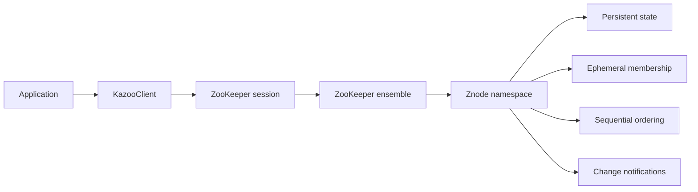
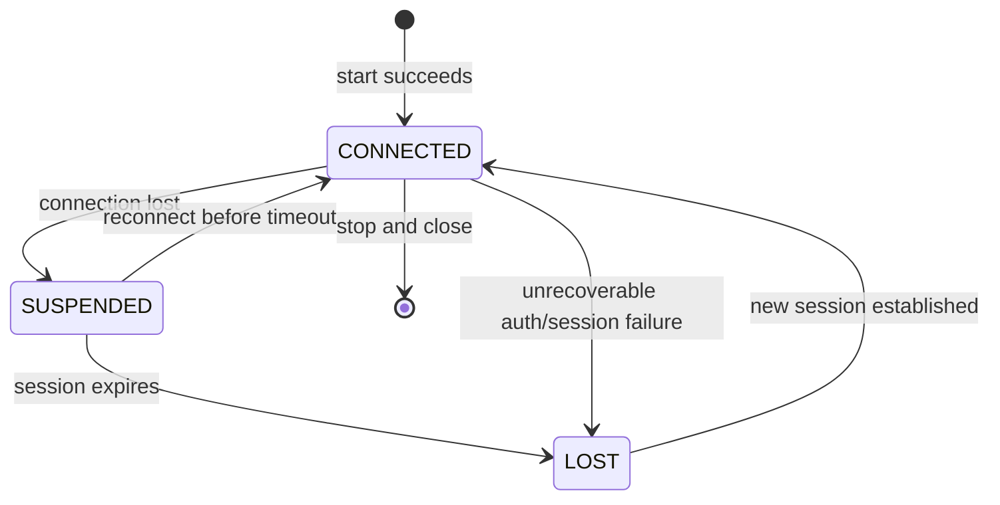
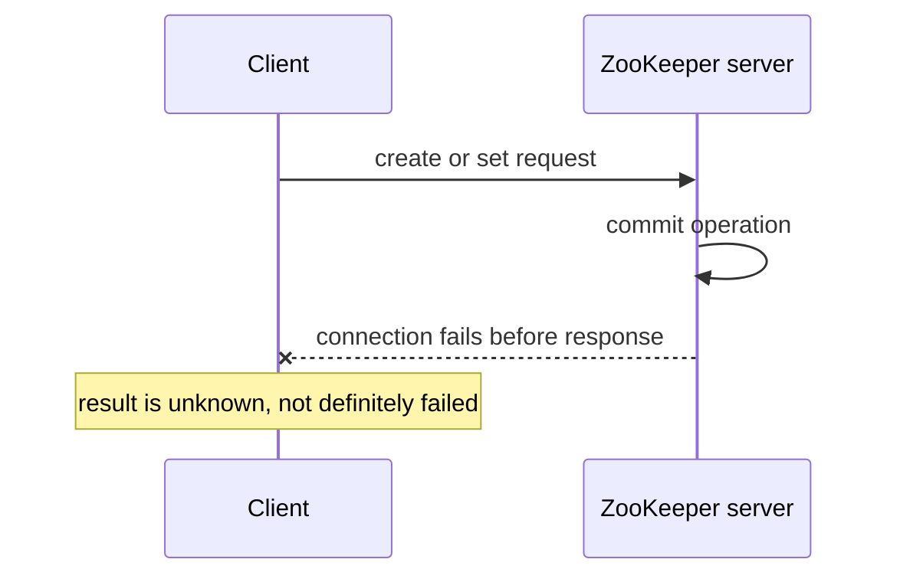

# ZooKeeper Client Guide: Common Patterns, Semantics, and Constraints

This guide explains how applications should use ZooKeeper safely, with runnable
examples for **Python and Kazoo 2.11.0**. The patterns apply to ZooKeeper clients in
general; Kazoo-specific behavior is called out explicitly.

> **Scope and source policy**
>
> - Current Apache ZooKeeper documentation is the primary source for service
>   semantics.
> - Kazoo 2.11.0 documentation and source are the primary sources for Python APIs.
> - The local ZooKeeper source tree is used to connect client behavior to server
>   implementation.
> - Configuration-dependent values are identified as such rather than treated as
>   universal protocol constants.

## 1. Mental model

ZooKeeper is not a general database or object store. It is a coordination service
whose most useful client primitives are:

- a hierarchical namespace of small znodes;
- atomic create, read, update, and delete operations;
- version numbers for compare-and-set;
- ephemeral nodes tied to a session;
- sequential nodes with server-assigned suffixes;
- one-shot watches and higher-level watch recipes;
- atomic multi-operation transactions;
- globally ordered writes and locally served reads.



The client library maintains a **session**, not merely a TCP connection. A temporary
connection loss does not immediately end the session or delete ephemeral nodes.
Session expiration does.

## 2. Local Python setup

This folder contains:

```text
requirements.txt       # kazoo==2.11.0
docker-compose.yml     # one local ZooKeeper server on localhost:2181
```

Create an isolated environment and start the local server:

```bash
python3 -m venv .venv
source .venv/bin/activate
python -m pip install -r requirements.txt
docker compose up -d
```

The repository ignores `.venv/`; do not commit virtual-environment contents.

Minimal connectivity check:

```python
from kazoo.client import KazooClient

zk = KazooClient(hosts="127.0.0.1:2181", timeout=10.0)

try:
    zk.start(timeout=15)
    print("connected:", zk.connected)
finally:
    zk.stop()
    zk.close()
```

`start(timeout=...)` waits for a connection. Always pair `stop()` with `close()`:
`stop()` ends the session cleanly, while `close()` releases client resources.

## 3. Session lifecycle is the first design concern

Kazoo summarizes session state into three values:

| Kazoo state | Meaning | Application response |
|---|---|---|
| `CONNECTED` | The session is usable through a server. | Resume operations that depend on ZooKeeper. |
| `SUSPENDED` | The connection is lost, but the session may still be alive. | Pause work that requires ownership, leadership, or fresh coordination state. |
| `LOST` | The session expired or authentication became unrecoverable. | Assume ephemeral nodes, locks, and leadership are gone; rebuild state after reconnect. |



Register a listener before starting:

```python
import logging
from threading import Event

from kazoo.client import KazooClient, KazooState

logging.basicConfig(level=logging.INFO)

zk = KazooClient(
    hosts="zk1:2181,zk2:2181,zk3:2181",
    timeout=10.0,
)

coordination_ready = Event()


def session_listener(state):
    if state == KazooState.CONNECTED:
        coordination_ready.set()
    elif state == KazooState.SUSPENDED:
        coordination_ready.clear()
        # Stop issuing side effects that assume this process still owns a lock
        # or remains the elected leader.
    elif state == KazooState.LOST:
        coordination_ready.clear()
        # The old session is gone. Recreate ephemerals and reacquire recipes
        # after Kazoo establishes a new session.


zk.add_listener(session_listener)
zk.start(timeout=15)
```

Keep listener work short and non-blocking. Signal the rest of the application rather
than performing slow recovery directly in a connection-management callback.

### Session constraints

- Do **not** create a new client object for every transient disconnect. Kazoo
  reconnects the existing session automatically.
- A client-requested timeout is negotiated and clamped by the server. By default,
  ZooKeeper derives the allowed range from `tickTime`; the common defaults are
  `2 * tickTime` through `20 * tickTime`, but operators can configure explicit
  bounds.
- Ephemeral nodes belong to the session, not to a socket.
- During `SUSPENDED`, the application cannot know whether the session will recover
  or expire. Treat exclusive ownership as uncertain.
- After `LOST`, assume all session-derived ownership is invalid.

## 4. Namespace design

Use a deliberate hierarchy:

```text
/my-service
  /config
    /current
  /discovery
    /instances
  /elections
    /primary
  /locks
    /resource-name
  /jobs
    /queue
```

Recommended conventions:

1. Give each application a root such as `/my-service`.
2. Separate persistent configuration from ephemeral membership.
3. Separate lock/election recipe paths from business data.
4. Store a schema/version marker in application-managed data.
5. Keep payloads small and encode them explicitly, for example UTF-8 JSON.
6. Avoid depending on child-list order unless sequential-node suffixes define it.

ZooKeeper paths are absolute and slash-separated. Relative paths, `.` and `..`
components, nulls, and several control/Unicode ranges are invalid. `/zookeeper` is
reserved for ZooKeeper metadata.

### Chroot

A connection string may contain a namespace suffix:

```python
zk = KazooClient(
    hosts="zk1:2181,zk2:2181,zk3:2181/my-service",
    timeout=10.0,
)
```

The application can then use `/config` while the actual ensemble path is
`/my-service/config`. Create the chroot root before deploying clients; Kazoo warns if
it does not exist.

## 5. Basic CRUD and optimistic concurrency

ZooKeeper reads and writes the whole znode value atomically.

```python
from kazoo.exceptions import BadVersionError, NodeExistsError, NoNodeError

path = "/my-service/config/current"

try:
    zk.create(path, b'{"mode":"safe"}', makepath=True)
except NodeExistsError:
    pass

data, stat = zk.get(path)
print(data.decode("utf-8"), stat.version)

try:
    new_stat = zk.set(
        path,
        b'{"mode":"fast"}',
        version=stat.version,
    )
except BadVersionError:
    # Another writer changed the node. Read, recompute, and retry deliberately.
    data, stat = zk.get(path)

try:
    zk.delete(path, version=stat.version)
except NoNodeError:
    pass
```

The `version` field is a compare-and-set token:

- read data and its `Stat`;
- compute the next value;
- write with `version=stat.version`;
- on `BadVersionError`, reread and decide whether to retry.

Passing `version=-1` disables this guard. Use `-1` only when overwriting concurrent
changes is intentionally safe.

Relevant `Stat` fields include:

| Field | Meaning |
|---|---|
| `czxid` | Transaction that created the node. |
| `mzxid` | Transaction that last changed node data. |
| `pzxid` | Transaction that last changed the child set. |
| `version` | Data version. |
| `cversion` | Child-list version. |
| `aversion` | ACL version. |
| `ephemeralOwner` | Owning session ID, or zero for a persistent node. |
| `numChildren` | Number of immediate children. |

## 6. Write failures can have ambiguous outcomes

The most important error-handling rule is:

> A timeout or connection-loss exception does not prove that a write failed.

The server may have committed the request and lost the response. Blindly retrying can
therefore duplicate a non-idempotent action.



### Safe reconciliation strategies

| Operation | Strategy |
|---|---|
| Create a known path | Read/`exists` after reconnect. Treat `NodeExistsError` as success only if the existing data/identity matches the intended object. |
| Versioned set/delete | Use the expected version. A repeated successful write observes an advanced version instead of silently applying twice. |
| Sequential create | Put a unique GUID in the node-name prefix, then scan children for that GUID before retrying. |
| Multi-operation transaction | Read back the invariant or marker node used by the transaction. |
| External side effect | Use an idempotency key in the external system; ZooKeeper cannot atomically commit with an unrelated database or API. |

Canonical sequential-create pattern:

```python
from uuid import uuid4

from kazoo.exceptions import ConnectionLoss, OperationTimeoutError

parent = "/my-service/jobs/queue"
request_id = uuid4().hex
prefix = f"{parent}/job-{request_id}-"


def find_existing():
    for child in zk.get_children(parent):
        if child.startswith(f"job-{request_id}-"):
            return f"{parent}/{child}"
    return None


try:
    created_path = zk.create(
        prefix,
        b'{"job":"reindex"}',
        sequence=True,
        makepath=True,
    )
except (ConnectionLoss, OperationTimeoutError):
    created_path = find_existing()
    if created_path is None:
        created_path = zk.create(prefix, b'{"job":"reindex"}', sequence=True)
```

Kazoo recipes such as `Lock` use the same unique-prefix/reconciliation idea.

## 7. Retries: choose the boundary deliberately

Ordinary Kazoo calls can surface connection and operation-timeout exceptions. Use
`zk.retry(...)` or `KazooRetry` only around operations whose outcomes can be safely
reconciled.

```python
from kazoo.retry import KazooRetry

read_retry = KazooRetry(
    max_tries=5,
    delay=0.1,
    backoff=2,
    max_delay=2,
    ignore_expire=False,
)

data, stat = read_retry(zk.get, "/my-service/config/current")
```

Guidance:

- Reads are normally safe to retry.
- A known-path create can be retried if `NodeExistsError` is reconciled.
- A versioned set/delete can be retried if the application checks the resulting
  state/version.
- Never wrap an arbitrary sequential create in an unconditional retry.
- Set retry deadlines. Infinite retries can hide an outage and block shutdown.
- Decide explicitly whether session expiration should abort the operation. For
  ownership-sensitive work, use `ignore_expire=False`.

## 8. Ephemeral and sequential nodes

### Ephemeral nodes

Use ephemeral nodes for facts that should disappear when the owning process loses
its ZooKeeper session:

- service-instance registration;
- group membership;
- lock/election contenders;
- temporary ownership records.

```python
import json

instance_path = "/my-service/discovery/instances/worker-a"
payload = json.dumps(
    {"host": "10.0.0.5", "port": 9000},
    separators=(",", ":"),
).encode()

zk.create(
    instance_path,
    payload,
    ephemeral=True,
    makepath=True,
)
```

Constraints:

- Ephemeral nodes cannot have children.
- They survive a temporary disconnect if the session reconnects in time.
- They are removed when the session closes or expires.
- A stale process can continue external side effects during a network partition.
  Session-based ownership is not a substitute for fencing at the protected resource.

### Sequential nodes

```python
created = zk.create(
    "/my-service/jobs/queue/job-",
    b"payload",
    sequence=True,
    makepath=True,
)
print(created)  # for example: /my-service/jobs/queue/job-0000000042
```

Sequential suffixes provide ordering among children of the same parent. The counter
is finite and can eventually wrap; do not parse it into assumptions beyond relative
ordering within the intended recipe.

Combine `ephemeral=True, sequence=True` for lock and election contenders.

## 9. Watches

### Native one-shot watches

ZooKeeper's traditional watches fire once and must be registered again.

```python
from kazoo.protocol.states import EventType


def changed(event):
    print(event.type, event.path)


data, stat = zk.get("/my-service/config/current", watch=changed)
```

Watch categories:

- `exists()` and `get()` establish data/existence watches;
- `get_children()` establishes a child watch;
- `set` triggers a data watch;
- `create` triggers a parent child watch and an outstanding existence watch;
- `delete` triggers the node's data watch and its parent's child watch.

Watches are ordered with ZooKeeper state changes, but are not delivered while the
client is disconnected. A node can be created and deleted while a disconnected
client has an existence watch, making the transient state unobservable.

### Kazoo `DataWatch` and `ChildrenWatch`

Kazoo recipes re-read and re-arm watches:

```python
@zk.DataWatch("/my-service/config/current")
def config_changed(data, stat, event=None):
    if data is None:
        print("configuration missing")
    else:
        print("configuration:", data.decode(), "version:", stat.version)


@zk.ChildrenWatch("/my-service/discovery/instances")
def membership_changed(children):
    print("instances:", sorted(children))
```

Important behavior:

- callbacks run immediately after registration and again after changes;
- returning `False` stops the watcher;
- callbacks must be idempotent because reconnect/re-read behavior can repeat an
  observed value;
- callbacks should be short; queue slow work elsewhere;
- a watch is a change hint, not the data itself—always use the value returned by the
  fresh read;
- broad child watches can produce a herd effect.

Modern ZooKeeper also supports persistent and persistent-recursive watches through a
separate API. Use them carefully: their fan-out and memory costs are broader than
traditional one-shot watches.

## 10. Atomic multi-operation transactions

Kazoo's transaction API executes a batch atomically:

```python
leader_data, leader_stat = zk.get("/my-service/elections/current")

txn = zk.transaction()
txn.check("/my-service/elections/current", version=leader_stat.version)
txn.set_data("/my-service/config/current", b'{"mode":"new"}')
txn.create("/my-service/audit/change-", b"config update", sequence=True)
results = txn.commit()
```

Use transactions when an invariant spans several znodes:

- check ownership/version and update state;
- create an object and its index entry;
- replace one logical path with create-plus-delete;
- enqueue work and update a counter.

Constraints:

- the batch is atomic inside ZooKeeper only;
- it cannot atomically include an external database, file, or network API;
- all request data must fit configured request/buffer limits;
- result lists may contain exception objects describing why the transaction failed;
- there is no native rename operation. Create-plus-delete in `multi()` is the closest
  atomic equivalent, but it creates a new node identity and metadata.

## 11. Read consistency and `sync`

ZooKeeper provides:

- globally ordered, atomic writes;
- FIFO ordering for operations from one client;
- a single-system-image guarantee for a client's observed history;
- locally served reads that can lag the leader.

Two clients connected to different replicas can briefly observe different current
values. When a workflow needs a replica to catch up with the leader before reading:

```python
zk.sync("/my-service/config/current")
data, stat = zk.get("/my-service/config/current")
```

Treat `sync` as an ordering/freshness tool, not as a universal substitute for an
application transaction. If a decision must be linearized with concurrent writers,
use a version check or a write/multi operation that participates in ZooKeeper's
global write order.

## 12. ACLs and authentication

Do not leave production coordination data world-writable.

Digest example:

```python
from kazoo.security import make_digest_acl

zk.add_auth("digest", "service-user:replace-with-secret")

service_acl = [
    make_digest_acl(
        "service-user",
        "replace-with-secret",
        read=True,
        write=True,
        create=True,
        delete=True,
        admin=True,
    )
]

zk.create(
    "/my-service/secure/config",
    b"value",
    acl=service_acl,
    makepath=True,
)
```

Common schemes include `world`, `auth`, `digest`, `ip`, SASL/Kerberos, X.509, and
configured pluggable providers. Scheme availability depends on server configuration.

Operational rules:

- inject credentials from a secret manager; never hard-code them;
- set ACLs when creating the node;
- understand that ACLs belong to each znode and do not automatically inherit like a
  filesystem;
- test reconnect behavior so authentication is re-established;
- restrict the admin/reconfiguration surfaces separately from application paths.

## 13. Common coordination patterns

Prefer mature recipes over hand-built protocols.

### 13.1 Service discovery and group membership

Each instance creates an ephemeral child containing its endpoint and metadata.
Consumers use a `ChildrenWatch` and read child data.

```python
import json
from uuid import uuid4

member_id = uuid4().hex
member_path = f"/my-service/discovery/instances/{member_id}"
zk.create(
    member_path,
    json.dumps({"host": "10.0.0.5", "port": 9000}).encode(),
    ephemeral=True,
    makepath=True,
)


@zk.ChildrenWatch("/my-service/discovery/instances")
def refresh_instances(children):
    instances = []
    for child in children:
        data, _ = zk.get(f"/my-service/discovery/instances/{child}")
        instances.append(json.loads(data))
    publish_to_local_balancer(instances)
```

Production implementations should tolerate a child disappearing between
`get_children` and `get`.

### 13.2 Distributed lock

```python
lock = zk.Lock("/my-service/locks/resource-a", identifier="worker-a")

with lock:
    perform_guarded_work()
```

Kazoo's lock uses ephemeral sequential contenders and watches the immediate
predecessor to avoid waking every waiter.

Constraints:

- Kazoo locks are not reentrant by default;
- suspend protected work on `SUSPENDED`;
- after `LOST`, the lock is gone;
- for irreversible external side effects, use a fencing token accepted and checked
  by the protected resource. A lock alone cannot stop a paused/stale process.

### 13.3 Leader election

```python
election = zk.Election("/my-service/elections/primary", "worker-a")


def run_as_leader():
    while coordination_ready.is_set():
        perform_leader_iteration()


election.run(run_as_leader)
```

`Election.run` blocks until the participant wins, then invokes the function.
Leadership should stop doing externally visible work as soon as the session becomes
`SUSPENDED`, and must be considered lost on `LOST`.

### 13.4 Dynamic configuration

Store a small serialized configuration value in a persistent node and use a
`DataWatch` to refresh local immutable configuration.

Good pattern:

1. Parse and validate the complete new value.
2. Atomically swap the application's local configuration.
3. Retain the previous valid configuration if parsing fails.
4. Report invalid data rather than silently accepting defaults.

### 13.5 Queue

Producers create sequential children. Consumers choose the lowest sequence.
Mature queue recipes handle contention, ambiguous creates, and watches.

```python
queue = zk.Queue("/my-service/jobs/queue")
queue.put(b"job-data")
item = queue.get()
```

ZooKeeper is appropriate for small coordination queues, not high-volume payload
streaming. Store large job bodies elsewhere and enqueue identifiers.

### 13.6 Counter

Kazoo's `Counter` implements a versioned compare-and-set loop:

```python
counter = zk.Counter("/my-service/counters/completed", default=0)
counter += 1
print(counter.value)
```

This is suitable for coordination-scale update rates, not analytics-scale counters.

### 13.7 Barriers and parties

Kazoo provides `Barrier`, `DoubleBarrier`, `Party`, and related recipes. They compose
ephemeral nodes, child counts, and watches. Test failure and session-expiry behavior
before using a barrier in a critical workflow.

## 14. Constraints and limits

| Constraint | Practical implication |
|---|---|
| Small znode payloads | ZooKeeper commonly enforces an approximately 1 MiB request/data sanity limit through `jute.maxbuffer`; it is configurable and applies to serialized requests, so keep data far smaller. |
| Session timeout bounds | The server negotiates within configured minimum/maximum values, commonly derived from `tickTime`. |
| Ephemeral nodes cannot have children | Use ephemeral children under a persistent parent, not a hierarchy rooted at an ephemeral node. |
| No native rename | Use create-plus-delete, optionally in a transaction, while accepting new node metadata/identity. |
| Reads can be stale | Use `sync`, version checks, or a write transaction according to the required guarantee. |
| Write result can be unknown | Reconcile ambiguous connection/time-out failures before retrying. |
| Watches are notifications, not durable event logs | Re-read state; do not depend on observing every transient intermediate value. |
| Sequential counter is finite | Do not treat the suffix as an unbounded application ID. |
| Per-server connection limits | `maxClientCnxns` and total connection limits are configuration-dependent. Share long-lived clients rather than opening per-operation sessions. |
| Outstanding-request throttles | `globalOutstandingLimit` and newer request-throttle settings can delay or reject load. Apply application backpressure. |
| Quorum availability | A majority of voting servers must be available for writes and session establishment. |
| ACLs are per node | Design and test ACL creation for every path; do not assume inheritance. |
| No cross-system transaction | Use idempotency, reconciliation, or an outbox-like workflow with external systems. |
| Recipe ownership is session-based | Use fencing when stale owners could damage an external resource. |

Specific defaults such as `maxClientCnxns`, snapshot thresholds, timeout bounds, and
request-size limits can change by ZooKeeper version and operator configuration.
Inspect the deployed ensemble rather than coding against assumed defaults.

## 15. Anti-patterns

Avoid:

1. **Creating a client per request.** Use one long-lived client per process or
   isolation boundary.
2. **Treating `SUSPENDED` as harmless.** Ownership is uncertain until reconnect or
   expiration resolves it.
3. **Assuming an exception means a write did not happen.** Reconcile first.
4. **Blindly retrying sequential creates.** Use a GUID in the prefix.
5. **Polling in tight loops.** Use watches and bounded reconciliation reads.
6. **Watching every contender in a lock.** Watch the immediate predecessor.
7. **Doing slow work inside watch/session callbacks.** Dispatch to application
   workers.
8. **Storing large objects or high-volume event streams.** Store pointers and use an
   appropriate data system.
9. **Using `version=-1` everywhere.** This silently discards concurrent changes.
10. **Implementing locks/elections from scratch.** Use Kazoo recipes unless the
    protocol and failure model have been reviewed carefully.
11. **Assuming a ZooKeeper lock fences a stale process.** Require a monotonic token at
    the protected resource.
12. **Using recipes over a read-only connection.** Coordination recipes require
    writes.

## 16. Production checklist

### Client construction

- use all ensemble addresses;
- set an intentional session timeout;
- configure TLS/SASL/authentication where required;
- use a chroot for application isolation;
- install a state listener before `start`;
- bound connection and command retries.

### Runtime

- expose `CONNECTED`, `SUSPENDED`, and `LOST` as metrics;
- pause lock/leader work on `SUSPENDED`;
- rebuild ephemeral registrations after `LOST`;
- record retry and ambiguous-result reconciliation counts;
- apply backpressure instead of building an unbounded local request queue;
- close the client during graceful shutdown.

### Data model

- keep znodes small;
- use versioned writes;
- document path ownership and ACLs;
- separate persistent data, membership, locks, and elections;
- design every write for ambiguous outcomes;
- use multi-operation transactions for cross-znode invariants.

### Operations

- verify server timeout and buffer settings;
- monitor outstanding requests and connection counts;
- test behavior during leader failure and quorum loss;
- test session expiration, not only short disconnects;
- configure transaction-log/snapshot maintenance on the ensemble;
- avoid even-sized voting ensembles unless there is a specific reason.

## 17. Testing failure behavior

Pure unit tests cannot reproduce the key session and ambiguity cases. Use a real
local ensemble for integration tests.

Test at least:

1. client starts before ZooKeeper and connects later;
2. one server restarts while the client remains active;
3. leader failure during reads and writes;
4. connection loss after the server may have committed a create;
5. reconnect before session timeout;
6. forced session expiration;
7. watch re-registration and missed transient states;
8. `BadVersionError` under concurrent writers;
9. lock/leader behavior on `SUSPENDED` and `LOST`;
10. graceful shutdown removes ephemeral registrations.

Kazoo includes testing harnesses that can run real ZooKeeper processes and helpers
for inducing connection loss and session expiration. For application tests, a local
three-server ensemble is more representative than the single-server Compose file.

## 18. Reference implementation skeleton

```python
from __future__ import annotations

import logging
from contextlib import contextmanager
from threading import Event

from kazoo.client import KazooClient, KazooState
from kazoo.exceptions import NodeExistsError

LOG = logging.getLogger(__name__)


class ZooKeeperRuntime:
    def __init__(self, hosts: str, timeout: float = 10.0) -> None:
        self.ready = Event()
        self.client = KazooClient(hosts=hosts, timeout=timeout)
        self.client.add_listener(self._on_state)

    def _on_state(self, state: KazooState) -> None:
        if state == KazooState.CONNECTED:
            self.ready.set()
        else:
            self.ready.clear()

        if state == KazooState.LOST:
            LOG.error("ZooKeeper session lost; ownership must be rebuilt")
        elif state == KazooState.SUSPENDED:
            LOG.warning("ZooKeeper connection suspended; pausing owned work")

    def start(self) -> None:
        self.client.start(timeout=15)

    def close(self) -> None:
        self.ready.clear()
        self.client.stop()
        self.client.close()

    @contextmanager
    def running(self):
        self.start()
        try:
            yield self
        finally:
            self.close()


if __name__ == "__main__":
    logging.basicConfig(level=logging.INFO)
    runtime = ZooKeeperRuntime("127.0.0.1:2181")
    with runtime.running():
        runtime.client.ensure_path("/examples")
        try:
            runtime.client.create("/examples/message", b"hello")
        except NodeExistsError:
            _, stat = runtime.client.get("/examples/message")
            runtime.client.set("/examples/message", b"hello", version=stat.version)
```

This example uses a version check for updates. Production code must additionally
reconcile connection-loss ambiguity around both `create` and `set`.

## 19. Sources

### Official Apache ZooKeeper

- [ZooKeeper Programmer's Guide](https://zookeeper.apache.org/doc/current/zookeeperProgrammers.html)
  — data model, sessions, watches, ACLs, time/order, and consistency guarantees.
- [ZooKeeper Administrator's Guide](https://zookeeper.apache.org/doc/current/zookeeperAdmin.html)
  — configuration-dependent limits, deployment, throttling, and maintenance.
- [ZooKeeper Recipes and Solutions](https://zookeeper.apache.org/doc/current/recipes.html)
  — locks, leader election, barriers, queues, and ambiguous-create handling.
- [ZooKeeper Internals](https://zookeeper.apache.org/doc/current/zookeeperInternals.html)
  — replication and consistency background.

### Official Kazoo

- [Kazoo documentation](https://kazoo.readthedocs.io/en/latest/)
- [Kazoo basic usage](https://kazoo.readthedocs.io/en/latest/basic_usage.html)
- [Kazoo API and recipes](https://kazoo.readthedocs.io/en/latest/api/)
- [Kazoo 2.11.0 package](https://pypi.org/project/kazoo/2.11.0/)

### Papers

- [ZooKeeper: Wait-free coordination for Internet-scale systems](https://www.usenix.org/conference/usenix-atc-10/zookeeper-wait-free-coordination-internet-scale-systems)
- [Zab: High-performance broadcast for primary-backup systems](https://doi.org/10.1109/DSN.2011.5958223)

### Local implementation evidence

- Client APIs: `java/org/apache/zookeeper/ZooKeeper.java`,
  `java/org/apache/zookeeper/ClientCnxn.java`
- Server session handling: `java/org/apache/zookeeper/server/ZooKeeperServer.java`,
  `java/org/apache/zookeeper/server/SessionTrackerImpl.java`
- Watch implementation: `java/org/apache/zookeeper/server/watch/`
- Request ordering and transactions: `java/org/apache/zookeeper/server/`,
  `java/org/apache/zookeeper/server/quorum/`
